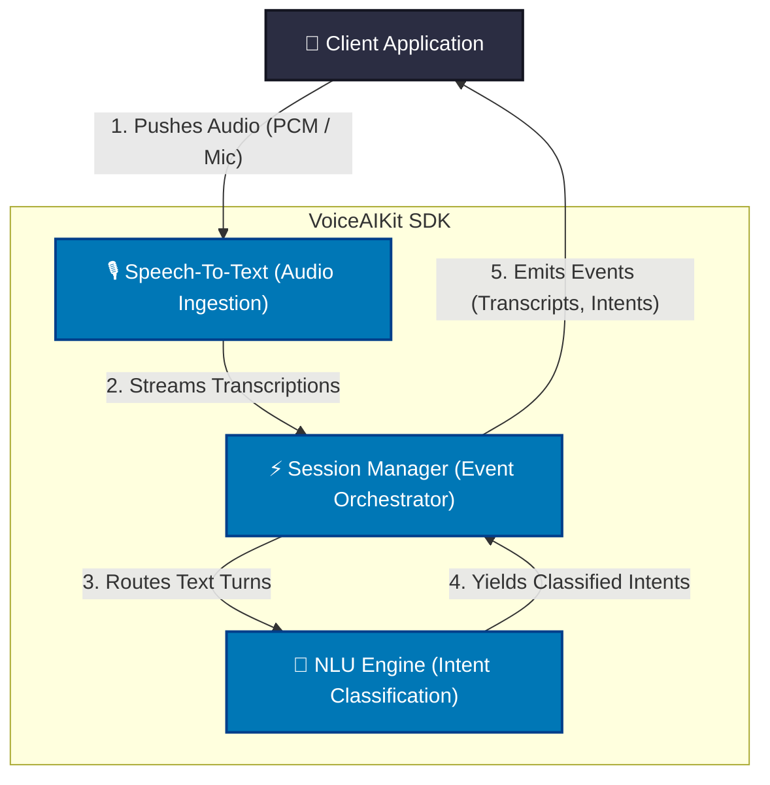
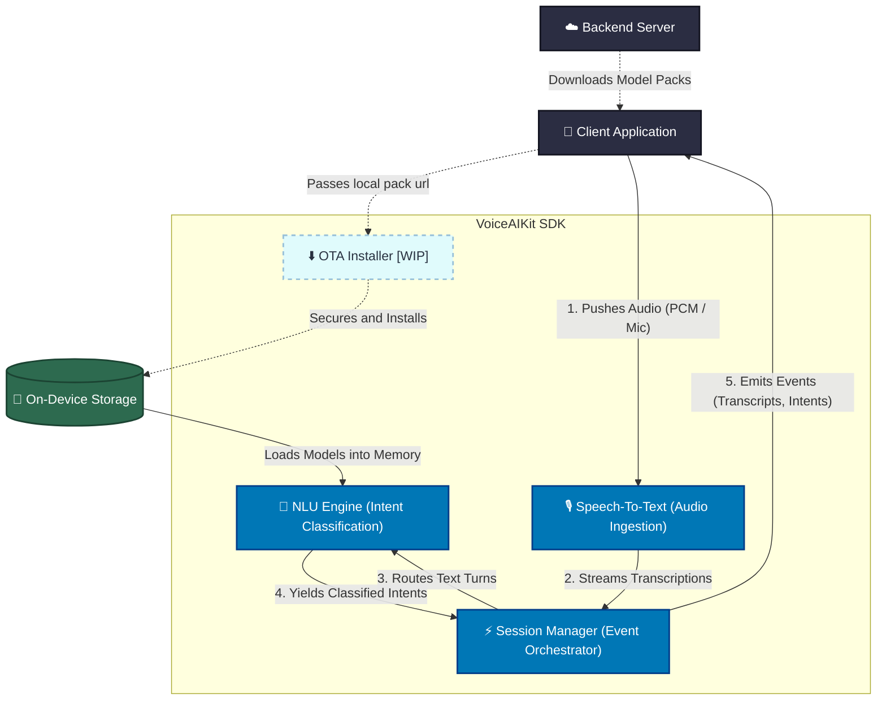
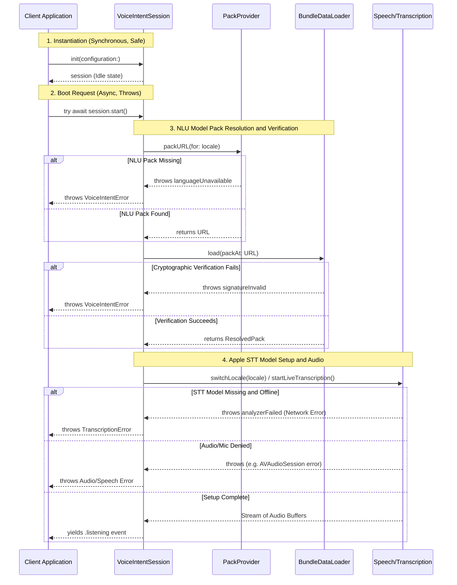
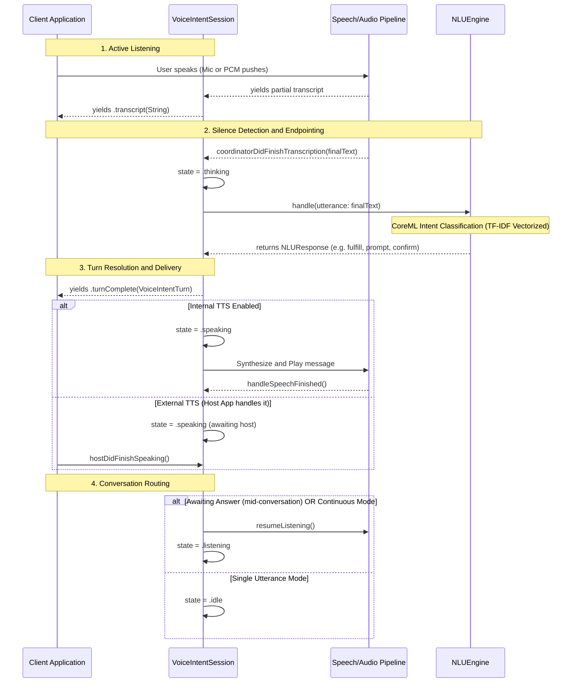

# VoiceAIKit Architecture Review

> [!NOTE]
> This document outlines the architectural design and internal structure of `VoiceAIKit`, an on-device Speech-to-Text (STT) and Intent Classification (NLU) SDK. It is designed for multi-turn dialogue, strict thread-safety via actors, and seamless Over-The-Air (OTA) updates.

## 1. System Architecture Overview

The system is decoupled into four primary domains: **Facade (Host Integration)**, **Audio & Speech (STT)**, **Natural Language Understanding (NLU)**, and **OTA Updates**.

### Simplified Live Inference View
*(Core pipeline without OTA/Storage complexity)*



### Full System Architecture (Including OTA)



### Core Tenets
*   **Decoupled Intelligence**: `NLUEngine` operates on abstract protocols (`IntentClassifying`, `SlotResolving`), oblivious to the underlying CoreML/TF-IDF models.
*   **Actor-Isolated Concurrency**: Heavy NLU classification happens on the `NLUEngine` actor's serial executor, preventing main-thread blocking. Audio ingestion uses lock-free `AsyncStream`s.
*   **Strict Storage Integrity**: Pack updates use atomic swaps (via `PackStorageController`) to prevent data corruption during OTA updates.

---

## 2. File-Level Responsibility Breakdown

### 📁 `Facade/` (Public API Surface)
The boundary between the Host App and the SDK logic.
*   **`VoiceIntentClient.swift`**: The global, `@Sendable` orchestrator. It manages the `NLUPackInstaller` and decides whether to load the active OTA pack or fallback to the bundled Seed Pack.
*   **`VoiceIntentSession.swift`**: Represents an active recording/conversation. Exposes an `AsyncStream<VoiceIntentEvent>` for the UI to consume live transcripts and intents. 
*   **`VoiceIntentPack.swift` & `PackIdentity.swift`**: Immutable structs representing the identity and metadata of a successfully loaded NLU model pack (used strictly for telemetry/attribution).

### 📁 `Core/` (Audio Ingestion & STT)
Handles hardware microphone access and Apple Speech integration.
*   **`Coordinator/TranscriptionCoordinator.swift`**: The main-actor orchestrator wiring the audio buffer tap to the transcription service.
*   **`Audio/AudioCaptureService.swift`**: Installs an `AVAudioEngine` tap. Captures live audio and streams `AVAudioPCMBuffer`s via an `AsyncStream`. Thread-safe via `OSAllocatedUnfairLock`.
*   **`Recognition/SpeechRecognitionService.swift`**: Wraps Apple's `SpeechAnalyzer` and `SpeechTranscriber`. Consumes the buffer stream, runs STT, and emits `TranscriptionResult`s.
*   **`Audio/SilenceDetector.swift` & `EndpointDecider.swift`**: Analyzes DBFS power levels and pause durations to automatically close the microphone when a user stops speaking.

### 📁 `NLU/` (Natural Language Understanding)
The dialog management system.
*   **`Engine/NLUEngine.swift`**: The core `actor`. Maintains multi-turn context (e.g., slot filling, confirmation gates). Converts raw transcribed text into structured intents.
*   **`Engine/ConfirmationGate.swift` & `SlotFormatting.swift`**: Manages mid-conversation state machines. For example, if a user intent is missing a required parameter, this layer formulates the follow-up question.
*   **`Engine/NLUContext.swift` & `NLUResponse.swift`**: Data models defining the engine's current state and its output payload back to the `VoiceIntentSession`.

### 📁 `Pack/` (Model Loading & Translation)
Bridges physical `.nlu` files into executable code.
*   **`Loader/BundleDataLoader.swift`**: Safely loads resources from the `.nlu` directory into memory.
*   **`Loader/PackEngineFactory.swift`**: The factory that wires the JSON schema and ML models into the `IntentClassifying` protocols expected by the `NLUEngine`.
*   **`Loader/PackIntentClassifier.swift`**: A concrete CoreML intent classifier wrapper.
*   **`Loader/PackTFIDFVectorizer.swift`**: Handles text tokenization and TF-IDF vectorization required before passing data to the CoreML model.
*   **`Schema/NLUBundle.swift`**: The JSON decodable representation of `bundle.json`. Enforces strict schema rules (failing on missing `compiler_version` or `required_runtime_features`).

### 📁 `OTA/` (Over-The-Air Updates) [WIP]
*   **`Installer/NLUPackInstaller.swift`**: Orchestrates the downloading, extracting, and smoke-testing of new OTA packs via the `NLUEngineProvider` protocol.
*   **`Validation/PackValidator.swift`**: Validates the cryptographic signatures and checks `currentRuntimeContract` to ensure the downloaded pack is compatible with the current SDK version.
*   **`Storage/PackStorageController.swift`**: Manages the `.nlu` filesystem. Uses a `PackRetentionPolicy` to keep older versions for strict rollback safety. Performs atomic symlink swaps for the `Current` pack.

---

## 3. VoiceIntentSession Boot Lifecycle & Error Handling

This section details the critical path from the moment the Host Application constructs a `VoiceIntentSession` until the microphone becomes active. It explicitly maps out all potential failure modes (Network, Storage, Cryptography, and Hardware Permissions) that can interrupt the boot sequence.

> [!NOTE]
> The synchronous `init` only configures the session and creates the audio provider. No failure occurs here. 
> The real work (and failure risk) happens asynchronously during `session.start()`, which runs the cryptographic checks, memory loads the AI models, and requests microphone permissions.

### Sequence Diagram: Client to Session Flow



### Step-by-Step Execution and File Touches

1. **Instantiation (`VoiceIntentSession.swift`)**
   - The Host App calls `init(configuration:)`.
   - The session synchronously initializes either the `TranscriptionCoordinator` (for microphone audio) or `AppAudioInputProvider` (for host-provided PCM audio). No heavy lifting or model loading occurs here.

2. **Boot Request (`VoiceIntentSession.swift`)**
   - The Host App calls `try await session.start()`.
   - The session calls its internal `prepare()` and `buildEngine()` methods to start setting up the NLU engine *before* touching any audio hardware.

3. **NLU Pack Resolution (`PackProvider.swift`)**
   - Before verifying anything, the session asks `PackProvider` for the `.nlu` pack URL for the requested language.
   - **Failure Point:** If the pack doesn't exist (no OTA downloaded and no bundled Seed Pack), it immediately throws `VoiceIntentError.languageUnavailable`. Unlike STT, the NLU pack does **not** auto-download during session boot (OTA is managed separately in the background).

4. **Cryptographic Validation (`BundleDataLoader.swift` & `PackIntegrity.swift`)**
   - Inside a background detached task, `BundleDataLoader.load(...)` verifies the Ed25519 signature and SHA-256 hashes.
   - **Failure Point:** Throws a `VoiceIntentError` if any file is tampered with or corrupted.

5. **Engine Construction (`PackEngineFactory.swift`)**
   - Memory-maps the CoreML NLU model.
   - **Failure Point:** Throws if the model format is invalid or memory is exhausted.

6. **Apple STT Asset Setup (`SpeechRecognitionService.swift`)**
   - Before opening the mic, the SDK checks if Apple's STT language model is installed via `SpeechTranscriber.installedLocales`.
   - If missing, it invokes `AssetInventory.assetInstallationRequest` to auto-download it.
   - **Failure Point:** If the device is offline during this download, or if Apple completely doesn't support the language, it throws a network error wrapped in `TranscriptionError.analyzerFailed` or `localeNotSupported`.

7. **Audio Hardware Setup (`TranscriptionCoordinator.swift` & `AudioCaptureService.swift`)**
   - `AudioCaptureService` attempts to tap the `AVAudioEngine` and acquire iOS microphone permissions.
   - **Failure Point:** Throws if mic permissions are denied or if `AVAudioSession` is locked.

8. **Active Listening (`VoiceIntentSession.swift`)**
   - If all the above steps succeed, the audio buffers begin streaming and `VoiceIntentSession` yields a `.listening` event into its `AsyncStream`, signaling to the Host App that the microphone is hot.

## 4. Live Transcription & Intent Classification Flow

Once the session is successfully booted and the microphone is hot, the SDK enters its active transcription and classification loop. This sequence maps the data flow from spoken audio to parsed NLU intents, including TTS delivery and conversation routing.

### Sequence Diagram: Audio to Intent



### Step-by-Step Execution

1. **Active Listening (`TranscriptionCoordinator`)**
   - As the user speaks, `SpeechRecognitionService` streams real-time partial transcripts back to the session.
   - The session forwards these to the Client App via `.transcript(String)` events for live UI updates (e.g., rendering the words on screen).

2. **Silence Detection and Endpointing (`TranscriptionCoordinatorDelegate`)**
   - When the user stops speaking, the coordinator detects silence (`commandSilence` timeout) and endpoints the turn.
   - It fires `coordinatorDidFinishTranscription(finalText:)`. The session transitions to the `.thinking` state.

3. **Intent Classification (`NLUEngine`)**
   - The session passes the final text to the `NLUEngine` (an Actor) for inference.
   - The engine runs a 3-stage pipeline: TF-IDF (keyword fallback), CoreML Semantic Head (embedding), and Action Extractor (slot filling).
   - It returns an `NLUResponse` (e.g., `.fulfill`, `.prompt`, or `.fallback`).

4. **Turn Resolution and Delivery (`VoiceIntentSession`)**
   - The session applies the outcome, yielding a `.turn(.fulfilled(...))` event to the Client App.
   - If there is a text response (e.g., "Setting your alarm"), the session enters the `.speaking` state. It either plays the audio via its internal TTS, or waits for the Host App to finish speaking it (`hostDidFinishSpeaking()`).

5. **Next Action Routing (`handleTurnAdvance()`)**
   - Once speaking concludes, the session decides what to do next based on conversation state:
     - If the system asked a follow-up question (`awaitingAnswer == true`) or is in `Continuous Mode`, it immediately reopens the microphone and goes back to `.listening`.
     - Otherwise, in single-utterance mode, it transitions safely to `.idle` and shuts down the audio tap.

## 5. The Anatomy of an NLU Pack (`.nlu`)
An NLU pack is a compressed archive containing all the machine learning models, dialog rules, and localized strings required to run VoiceAIKit offline. The SDK is designed to be a "dumb engine" — it has zero hardcoded logic about intents, slots, or dialogs. Everything is driven completely by the contents of the pack.

This allows the team to update the assistant’s behavior, add new features, or change spoken replies *without* releasing a new iOS app update.

Here is the exact folder structure and purpose of each component inside a downloaded `.nlu` pack:


> [!WARNING]
> **Schema Volatility Notice**
> The folder structure and file contents documented below are not yet finalized. We are actively experimenting with different schemas. As the NLU compilation pipeline is fully implemented on the backend Python repository, this structure is subject to change. It is highly likely that certain configuration files may be removed, consolidated, or have their internal data structures modified in future iterations.

### 1. Root & Security (`/` & `/integrity/`)
- **`bundle.json`**: The entry point. Contains metadata (version, target schema, `key_id`) and the `checksums_root`. This is the only file read before cryptographic validation begins.
- **`integrity/signature.sig`**: The raw Ed25519 digital signature generated by the backend compiler.
- **`integrity/manifest.sha256`**: A list of every single file in the pack and its expected SHA-256 hash. If any file is modified, or if an unlisted file is secretly added, the SDK rejects the pack and rolls back.

### 2. Machine Learning Models (`/models/`)
- **`models/semantic_head/`**: Contains `SemanticHead.mlmodelc`. A language-agnostic embedding model that converts transcribed text into high-dimensional semantic vectors.
- **`models/intent/<language>/`**: Contains `IntentClassifier.mlmodelc` and `intent_classifier_weights.json`. The CoreML model is built on top of TF-IDF vectors to predict the user’s actual intent (e.g., `reminders.add`).
- **`models/intent/<language>/labels.json`**: Maps the numeric output of the CoreML model back to human-readable intent strings.
  ```json
  [
    "Cmd.VolumeDecrease",
    "Cmd.VolumeIncrease",
    "Cmd.VolumeMute"
  ]
  ```

### 3. Dialog & Workflows (`/capabilities/`)
The SDK doesn’t hardcode business logic. Each capability (e.g., `capabilities/reminders/`) defines its own rules:
- **`capability.json`**: Defines the intent schema and required slots (parameters). For example, creating a reminder requires knowing *what* to remind the user about, and *when* to remind them.
  ```json
  {
    "id": "reminders",
    "actions": [
      {
        "key": "reminders.add",
        "params": [
          { "name": "name", "required": true },
          { "name": "date_time", "required": true }
        ]
      }
    ]
  }
  ```
- **`workflows.json`**: The conversation state machine. It tells the SDK exactly what to do if a required slot is missing (e.g., if the user just says "Create a reminder", the SDK knows it needs to prompt for the `name` and `date_time`).
  ```json
  {
    "intents": {
      "reminders.add": {
        "slots": [
          { "name": "name", "prompt": "reminders.add.ask_name", "required": true },
          { "name": "date_time", "prompt": "reminders.add.ask_date_time", "required": true }
        ]
      }
    }
  }
  ```
- **`responses/<language>.json`**: The localized text the assistant will actually speak. When the workflow says to trigger `reminders.add.ask_date_time`, the SDK looks up the exact string here. This means copy changes are shipped OTA without App Store updates.
  ```json
  {
    "reminders.add.ask_name": "What do you want to be reminded?",
    "reminders.add.ask_date_time": "When should I remind you? You can say things like '9am' or 'tomorrow at 3'."
  }
  ```

### 4. Language & Text Rules (`/lexicons/` & `/keywords/`)
- **`lexicons/<language>.json`**: Contains stop-words, synonyms, and fuzzy matching rules. Used to sanitize transcripts before inference (e.g., stripping out "um", "uh", "please").
- **`keywords/<language>.json`**: Contains localized regex routing and system keywords used by the dialog manager to handle explicit commands without passing through the heavy CoreML models.
  ```json
  {
    "lang": "en",
    "rules": [
      {
        "intent": "Cmd.VolumeMute",
        "pattern": "^mute$",
        "tier": 1
      }
    ]
  }
  ```

### 5. Engine Configurations (`/runtime/`)
**The Problem:** The `models/` folder only outputs raw predictions (Maths), and `capabilities/` only provides dialogue strings (English). If the logic to connect them (e.g., determining confidence thresholds or deciding which model to run first) were hardcoded in Swift, every minor behavior tweak would require an App Store update.

**The Solution:** The `/runtime/` folder acts as the NLU Engine’s "Control Panel". It keeps the SDK logic-free by defining the rules OTA:
- **`runtime/cascade.json`**: Tells the SDK the exact order of execution (e.g., check keywords first, then run TF-IDF/CoreML).
- **`runtime/policies.json`**: Owns the decision thresholds and the confirmation policy. `thresholds.confidence` (0.7) is the fire bar — below it the engine returns a fallback, which the SDK hands to the Host App; `thresholds.interrupt` (0.68) is the bar a new intent must clear to abandon a slot flow in progress; `confirmation` says which intents ask before acting. `limits` carries `max_slot_attempts` and the session timeout.
- **`runtime/plan_facts.json`**: Capability mappings and systemic constraints.

> There is no `runtime/routing.json`. Packs used to ship one — a two-step
> `reprompt`/`give_up` escalation ladder plus an `assist_cloud` switch — that this
> SDK decoded and never consulted, and that the compiler copied verbatim out of a
> spec EXAMPLE rather than authoring. Its `reprompt`-below-confidence step described
> behaviour neither runtime has: both are binary at the fire bar. It was removed from
> both sides rather than wired, so that nothing in the pack looks tunable that is not.
> See VIK-030. The escalation ladder ADR-004 actually designs is a separate, unbuilt
> piece of work; when it lands it comes back as a section with a consumer.

This allows Data Scientists to tweak and optimize the engine’s behavior directly from the cloud without iOS developer intervention.

### 6. Analytics & Telemetry (`/telemetry/`)
**The Problem:** When the SDK processes audio or downloads a pack, it sends analytics back to the server (e.g., status strings like "fulfilled", "low_confidence", or "rolled_back"). If these enum strings were hardcoded in Swift, adding a new telemetry state would break the frontend-backend sync and require a new iOS release.

**The Solution:** 
- **`telemetry/schema.json`**: Defines all possible telemetry states and enums expected by the backend. The SDK reads this schema and ensures it only sends valid strings to the analytics dashboard. If the backend team wants to track a new outcome, they simply update the pack, and the SDK automatically begins supporting the new telemetry event.

### 7. Meta (`/meta/`)
- **`meta/report_card.json`**: CI/CD build metrics. Contains the F1 scores, precision, and recall of the models against the test set when this pack was compiled. (Not used at runtime; purely for traceability).

---

## 6. Principal Engineer Review: Critical System Questions
During an architecture review, expect a Principal Engineer or Systems Architect to probe deeply into thread-safety, memory limits, and edge cases. Below are the rigorous questions they will ask:

> [!CAUTION]
> **1. Actor Reentrancy & Priority Inversion**
> *"The `NLUEngine` is an `actor`. CoreML classification can be a synchronous, CPU-heavy operation. If we execute inference directly on the actor's executor, do we risk priority inversion? What happens if a high-priority UI task needs to query the engine's `state` while a 300ms CoreML pass is blocking the actor? Are we utilizing `Task.detached` or yielding `await` appropriately?"*

> [!WARNING]
> **2. Atomic File Swaps vs. Active File Handles**
> *"I see `PackStorageController` manages atomic swaps for the `Current` active pack. What is the exact behavior if the installer executes a symlink swap on the file system at the exact microsecond `BundleDataLoader` is parsing `bundle.json` or memory-mapping a CoreML model on a background thread? Do we rely on POSIX file-handle safety, or is there a reader-writer lock bridging the OTA and NLU domains?"*

> [!IMPORTANT]
> **3. Audio Tap Real-Time Constraints (Glitching)**
> *"`AudioCaptureService` pipes `AVAudioPCMBuffer`s into an `AsyncStream.Continuation`. The `AVAudioEngine` tap block executes in a real-time audio context. If our downstream consumer (`SpeechRecognitionService`) yields or suspends, does the continuation lock block the audio thread? This is a classic source of audio glitching on iOS."*

> [!TIP]
> **4. Strict Memory Footprint (Jetsam Limits)**
> *"If this SDK runs in a background Siri extension or a tight memory environment, the jetsam limit might be 50MB. Does `PackEngineFactory` aggressively memory-map the models, or does it load the entire TF-IDF vocabulary into the heap? How does `MemoryProbe` monitor and forcefully evict idle models when `isEngineIdle` becomes true?"*

> [!NOTE]
> **5. Forward/Backward Schema Compatibility**
> *"If a user's app isn't updated for 6 months, their SDK's `currentRuntimeContract` stays at `v1`. The backend pushes a `v2` OTA pack. According to `PackValidator`, it will reject it. What is our telemetry strategy for tracking these 'orphaned' clients? Does the SDK silently swallow the update failure, or is the host app explicitly notified so it can force a mandatory App Store update?"*

> [!CAUTION]
> **6. The Smoke-Test Boot Loop**
> *"In `NLUPackInstaller.swift`, you run a 'smoke test' via `NLUEngineProvider` before committing a pack. If the smoke test crashes (e.g., a fatal error inside CoreML due to an invalid tensor shape), the whole host app crashes. Upon reboot, the app will try to install the same staged pack again, causing an infinite crash loop. How does `PackStorageController` isolate or quarantine staged packs that cause fatal process terminations?"*

---
