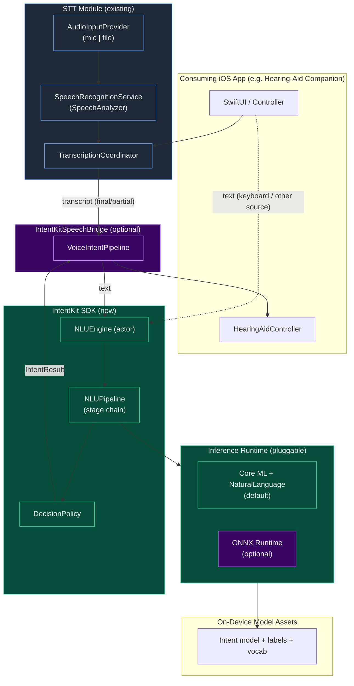
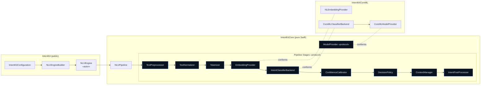
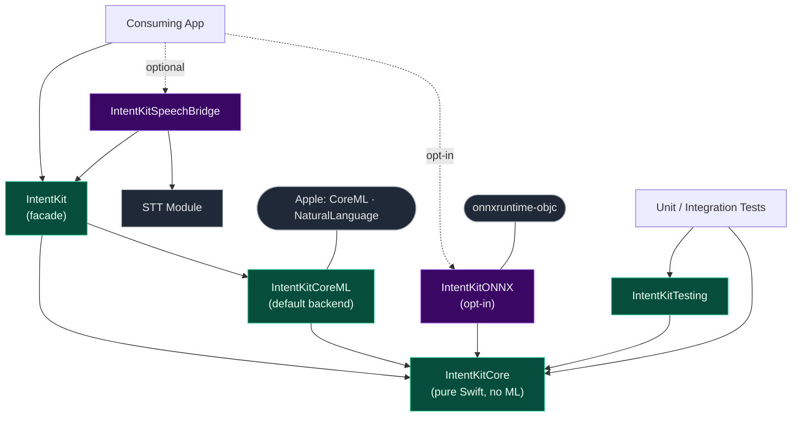
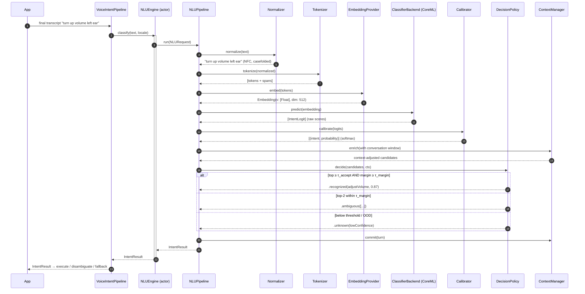

# IntentKit — On-Device NLU / Intent Classification SDK

### A production-grade, reusable Swift Package to replace Dialogflow, layered on the existing STT module

**Author:** Principal iOS / On-Device AI Architecture Review
**Target:** iOS 26+ · Swift 6 · Xcode 26+
**Status:** Architecture proposal + reference scaffold

---

## 0. Executive summary

The folder under review contains a clean, production-grade **Speech-to-Text (STT) module** built on Apple's `SpeechAnalyzer` / `SpeechTranscriber` (iOS 26). It does *not* contain the intent-classification / NLU layer — the README treats that as a future downstream stage (`Audio → SpeechAnalyzer → Text → ONNX Model → Intent`) and only sketches a hypothetical `onnxClassifier.classify(text:)` call. So the task is not to *refactor* an existing NLU implementation, but to **design one from scratch** — with the STT module as both the upstream data source and the architectural template to match.

This document delivers:

1. A candid review of the existing STT architecture — strengths, weaknesses, code smells, coupling, and performance concerns (it is the foundation the NLU layer sits on, and its patterns set the house style).
2. A new, modular NLU architecture where each pipeline stage has a single responsibility and the inference runtime is a swappable dependency.
3. The SDK design: public API, internal modules, and Swift Package organization.
4. Four Mermaid diagrams: high-level system, component, package/module, and the end-to-end classification sequence.
5. The complete data-flow narrative from raw user input to a classified intent.
6. Concrete recommendations for performance, memory, model loading, extensibility, testability, and concurrency.
7. A justification for every major decision — including why I recommend **Core ML + the Natural Language framework behind a runtime-agnostic protocol** rather than hard-wiring ONNX as the README implies.

A companion compilable Swift Package scaffold (`IntentKit/`) accompanies this document.

---

## 1. Review of the existing architecture

### 1.1 What the module actually is

The reviewed code is a **voice-capture + transcription pipeline**, structured as:

```
AudioInputProvider (mic | file)  →  SpeechRecognitionService (SpeechAnalyzer)  →  TranscriptionCoordinator (public API)  →  Delegate / AsyncStream  →  SwiftUI ViewModels & Views
```

There is no tokenizer, embedding, classifier, confidence/threshold logic, unknown-intent handling, or context manager anywhere in the tree. The intent layer is greenfield.

### 1.2 Strengths — patterns worth preserving

The STT module is genuinely well built, and the NLU SDK should inherit its good habits:

- **Protocol-oriented seams in the right places.** `AudioInputProvider` is a textbook Open/Closed abstraction: mic, file, or a future network source are interchangeable, and `SpeechRecognitionService` is agnostic to which it consumes. This is exactly the kind of seam the NLU layer needs around its inference engine.
- **Dependency injection with sensible defaults.** `TranscriptionCoordinator.init(...)` injects the session manager, recognition service, and *factory closures* for capture services, while a `convenience init()` wires production defaults. Consumers get one-line setup; tests get full control. `AudioCaptureService.init(engine:)` injects `AVAudioEngine` for the same reason.
- **A dual consumer API.** Both a `TranscriptionDelegate` (callback style) and an `AsyncStream<TranscriptionResult>` (structured-concurrency style) are offered. Different apps integrate differently; supporting both is the right call for a reusable SDK.
- **Deliberate, well-documented concurrency.** The `withThrowingTaskGroup` that runs the analyzer and drains `transcriber.results`, the deep-copy of tap buffers before they cross task boundaries (`AudioCaptureService`), and the `@MainActor` annotations on AV objects that require it, are all correct and carefully commented. The comment explaining `finalizeAndFinishThroughEndOfInput()` is the kind of institutional knowledge most codebases lose.
- **Value-typed, `Sendable` results.** `TranscriptionResult` is an immutable `struct` — safe to hand across actors. `TranscriptionError` and the state enums give a clean, exhaustive surface.
- **Thoughtful asset lifecycle.** `ensureModelInstalled` reconciles the three real states of on-device models — *supported*, *installed*, and *reserved/allocated* — which is a subtlety most implementations miss. This directly informs how the NLU SDK should manage its own model assets.

### 1.3 Weaknesses, code smells, and coupling

None of these are fatal, but each is a pattern the NLU layer must *not* replicate:

1. **Blanket `@MainActor` isolation.** `SpeechRecognitionService` and the coordinator are `@MainActor` because `AVAudioEngine` requires it. That is defensible for audio. **It must not be inherited by the NLU layer.** Tokenization, embedding, and Core ML inference are CPU/ANE-bound and belong *off* the main actor — otherwise every classification risks a frame hitch on the UI thread. The NLU engine should be an `actor`, not `@MainActor`.

2. **`TranscriptionCoordinator` is drifting toward a God-object.** It owns permission requests, `UserDefaults` locale persistence, session configuration, *both* live and file orchestration, delegate fan-out, and conformance to two delegate protocols. Several of these are separable responsibilities (SRP). The NLU orchestrator should stay thin and delegate to a pipeline.

3. **Persistence coupled into the coordinator.** `localeDefaultsKey` and direct `UserDefaults.standard` reads/writes are baked into the coordinator. This couples business logic to a concrete storage mechanism (violates DIP) and makes locale-selection behavior hard to test in isolation. Preferences should be injected behind a small `protocol`.

4. **Hot-path logging.** `SpeechRecognitionService` logs per buffer (`bufferCount % 50`), and both partial and final results are logged at `.info` including the transcribed text. For a **hearing-aid / medical** context this is a privacy concern (PII in logs) and a throughput concern. Logging should be gated behind a level and should redact content by default.

5. **Confidence is always `nil`.** Every `TranscriptionResult` is constructed with `confidence: nil`. The one signal the NLU layer would love to consume from upstream is thrown away. Even if `SpeechTranscriber` doesn't surface a score today, the field should be plumbed so the NLU decision policy can fuse ASR confidence with intent confidence later.

6. **Fragile shared-continuation swap.** `transcribeFile` temporarily swaps `resultsContinuation` for a local one and restores it in a `defer`. It works, but mutating a shared stream continuation mid-flight is subtle and would break under concurrent calls. A per-operation stream would be safer.

7. **View-model / SwiftUI lifecycle leak into the contract.** `LiveTranscriptionViewModel` documents that it must *not* set `coordinator.delegate` in `init` because SwiftUI re-creates throwaway view models — so wiring is deferred to `activate()`. That's a smell that a single mutable `delegate` property causes ownership ambiguity. An `AsyncStream`-first or multicast design avoids "who owns the delegate" entirely.

8. **Metering is faked.** The live audio level is a `sin()` animation because the single tap is owned exclusively by `AudioCaptureService`. Cosmetic, but it signals the provider should expose a metering callback rather than force consumers to fake it.

### 1.4 Verdict

The STT module is a solid B+ foundation with an A-grade concurrency story and a couple of God-object / coupling smells. **We keep its protocol-seam + DI + dual-API DNA, and we consciously diverge on two points for NLU: (a) off-main-actor execution, and (b) storage/policy behind injected protocols rather than baked in.**

---

## 2. Proposed NLU architecture

### 2.1 Design principles

- **One stage, one responsibility (SRP).** Normalization, tokenization, embedding, classification, calibration, decisioning, context, and post-processing are *distinct* protocols. No stage knows the internals of another.
- **Depend on abstractions (DIP).** The pipeline depends on protocols; concrete Core ML / ONNX / remote backends are plugged in at the composition root.
- **Open for extension, closed for modification (OCP).** Adding a new embedding model, a new backend, or a new post-processor never requires editing the pipeline engine.
- **Small, focused protocols (ISP).** A consumer that only wants single-shot classification never touches context or streaming types.
- **Substitutability (LSP).** Any `IntentClassifierBackend` is interchangeable; the decision policy behaves identically regardless of backend.
- **The classifier does not decide.** The model returns a probability distribution; a separate, *configurable* `DecisionPolicy` owns thresholds, margins, out-of-scope detection, and the "unknown" verdict. This is the single most important separation and the thing Dialogflow's opaque "fallback intent" gets wrong for on-device use.

### 2.2 The pipeline as a chain of typed transforms

Rather than a tangle of components calling each other, the NLU flow is a **linear pipeline** over an immutable, growing context envelope. Each stage receives the accumulated context and returns an enriched copy:

```
NLURequest
   │
   ▼  Preprocess        (trim, strip control chars, language hint)
   ▼  Normalize         (Unicode NFC, casefold, expand contractions, digit/unit canon.)
   ▼  Tokenize          (NLTokenizer / subword — produces tokens + spans)
   ▼  Embed             (sentence vector: NLEmbedding or Core ML encoder)
   ▼  Classify          (backend → raw logits per intent label)
   ▼  Calibrate/Score   (softmax + temperature → calibrated probabilities)
   ▼  Decide            (threshold + margin + OOD → recognized | ambiguous | unknown)
   ▼  Manage Context    (fuse with conversation state; resolve follow-ups)
   ▼  Post-process      (slot/entity extraction, label mapping, formatting)
   │
   ▼
IntentResult
```

Stages are ordered but **individually replaceable and individually testable**. A single-turn command app can drop the context stage entirely (a no-op `StatelessContextManager`); a conversational app injects a windowed one — with zero changes to the engine.

### 2.3 Component responsibilities

| Stage / Component | Protocol | Single responsibility | Default implementation |
|---|---|---|---|
| Preprocessing | `TextPreprocessor` | Cheap, model-independent cleanup: trim, strip control/zero-width chars, drop empties | `DefaultTextPreprocessor` |
| Normalization | `TextNormalizer` | Unicode NFC, case folding, contraction/number/unit canonicalization, locale-aware | `UnicodeTextNormalizer` |
| Tokenization | `Tokenizer` | Text → tokens + character spans (word or subword) | `NLWordTokenizer` (Natural Language) / `WordPieceTokenizer` |
| Embedding | `EmbeddingProvider` | Tokens/text → fixed-length `Embedding` vector | `NLEmbeddingProvider` / `CoreMLEncoder` |
| Classification | `IntentClassifierBackend` | Embedding → raw `[IntentLogit]` over the label set | `CoreMLClassifierBackend` / `ONNXClassifierBackend` |
| Confidence scoring | `ConfidenceCalibrator` | Logits → calibrated probabilities (softmax/temperature/Platt) | `SoftmaxCalibrator` |
| Threshold & unknown | `DecisionPolicy` | Probabilities + context → accept / ambiguous / reject(unknown/OOS) | `ThresholdMarginPolicy` |
| Context | `ContextManager` | Maintain conversation state, resolve follow-ups, slot carry-over | `StatelessContextManager` / `SlidingWindowContextManager` |
| Post-processing | `IntentPostProcessor` | Entity/slot extraction, label→domain mapping, output shaping | `CompositePostProcessor` |
| Model supply | `ModelProvider` | Locate, load, version, and cache model + label/vocab assets | `BundledModelProvider` / `DownloadableModelProvider` |
| Orchestration | `NLUEngine` (actor) | Run the stage chain; expose the public API; own concurrency | — |
| Composition | `NLUEngineBuilder` / `IntentKitConfiguration` | Assemble stages from config at the composition root | — |

### 2.4 Confidence, thresholds, and unknown-intent handling — done properly

This is where on-device NLU earns its keep over a cloud service. The `DecisionPolicy` receives calibrated probabilities and returns a typed verdict:

```
enum IntentDecision {
    case recognized(Intent, confidence: Double)          // top ≥ τ_accept AND margin ≥ τ_margin
    case ambiguous([IntentCandidate])                    // top-2 within τ_margin of each other
    case unknown(reason: RejectionReason)                // below threshold / out-of-scope
}
```

Three independent, tunable signals — not one magic number:

- **Absolute threshold (`τ_accept`)** — the top probability must clear a floor.
- **Margin (`τ_margin`)** — the gap between the top-1 and top-2 must be wide enough to be confident it isn't a coin-flip between two intents. This alone eliminates a large class of Dialogflow-style misfires.
- **Out-of-distribution detection** — one or more of: a dedicated `None`/out-of-scope label trained into the head, a max-probability floor, or prediction **entropy** (a near-uniform distribution ⇒ the utterance matches nothing). On-device we *can* afford this; a cloud API usually gives you only a single confidence float.

Because the policy is a protocol, product teams tune thresholds — or swap in an entropy-based policy — **without touching the model or the pipeline**. Thresholds live in `IntentKitConfiguration`, not in code.

### 2.5 Context management (optional, decoupled)

`ContextManager` is injected and defaults to a no-op. When present it:

- keeps a bounded window of recent `(utterance, intent, slots)` turns,
- lets the `DecisionPolicy` bias toward plausible follow-ups (e.g. "turn it up" after a "volume" intent),
- carries slots forward for multi-turn slot-filling.

Single-turn apps pay nothing; conversational apps opt in. The engine never hard-codes conversation semantics.

---

## 3. SDK design — public API, modules, and package layout

### 3.1 The public surface (what a consuming app sees)

The design goal from the brief: *"initialize the SDK and call a simple API."* One facade, one call.

```swift
import IntentKit

// 1. Initialize once (async — models load off the main actor).
let engine = try await NLUEngine(
    configuration: .coreML(
        model: .bundled(name: "HearingAidIntents"),
        acceptThreshold: 0.60,
        marginThreshold: 0.15
    )
)

// 2a. Single call — the whole pipeline behind one method.
let result = try await engine.classify("turn up the volume in my left ear")

switch result.decision {
case .recognized(let intent, let confidence):
    hearingAidController.execute(intent, slots: result.slots)   // e.g. .adjustVolume(ear: .left, direction: .up)
case .ambiguous(let candidates):
    ui.presentDisambiguation(candidates)
case .unknown:
    ui.presentFallback()
}

// 2b. Streaming: classify partial transcripts as they arrive (speculative), commit on final.
for await result in engine.classifications { … }
```

Key properties of the surface:

- **The pipeline is invisible.** No consumer ever sees a tokenizer or an embedding unless they ask for advanced configuration.
- **`async throws` initializer** so model loading, asset reservation (mirroring the STT `AssetInventory` pattern), and warm-up happen before first use — never lazily on the hot path.
- **Convenience factory configurations** (`.coreML(...)`) for the 90% case; a `NLUEngineBuilder` for full control (custom stages, backends, policies) for the 10%.
- **Dual API parity with the STT module** — a one-shot `classify(_:)` and an `AsyncStream` of results — so both SDKs feel like one family.

### 3.2 The STT → NLU bridge (composition without coupling)

The two SDKs **must not depend on each other**. A thin, optional adapter in a separate module wires them so partial/final transcripts flow into classification:

```swift
// IntentKitSpeechBridge (separate target; depends on both, neither depends on it)
let pipeline = VoiceIntentPipeline(transcriber: transcriptionCoordinator, engine: nluEngine)
for await intent in pipeline.intents {           // STT finals → NLU → IntentResult
    hearingAidController.execute(intent)
}
```

This keeps `IntentKit` usable by any app with *any* text source (keyboard, share-sheet, another ASR), and keeps the STT module free of NLU concerns.

### 3.3 Swift Package structure

Multiple targets so a consumer pulls in **only** what they need — a keyboard-driven app never links Core ML if it supplies its own backend, and no app links ONNX unless it opts in.

```
IntentKit/
├── Package.swift
├── Sources/
│   ├── IntentKit/                    # PUBLIC facade — the only import most apps need
│   │   ├── NLUEngine.swift           #   actor: orchestrates the pipeline
│   │   ├── NLUEngineBuilder.swift    #   composition root / builder
│   │   ├── IntentKitConfiguration.swift
│   │   └── PublicModels.swift        #   Intent, IntentResult, IntentDecision, IntentCandidate
│   │
│   ├── IntentKitCore/                # Pure Swift. NO ML deps. The contracts + engine.
│   │   ├── Pipeline/
│   │   │   ├── NLUPipeline.swift     #   the stage-chain runner
│   │   │   ├── PipelineStage.swift   #   the stage protocol + context envelope
│   │   │   └── NLUContext.swift
│   │   ├── Protocols/                #   TextPreprocessor, TextNormalizer, Tokenizer,
│   │   │   ├── TextProcessing.swift  #   EmbeddingProvider, IntentClassifierBackend,
│   │   │   ├── Inference.swift       #   ConfidenceCalibrator, DecisionPolicy,
│   │   │   ├── Decision.swift        #   ContextManager, IntentPostProcessor, ModelProvider
│   │   │   ├── Context.swift
│   │   │   └── ModelProvider.swift
│   │   ├── Stages/                   #   Default pure-Swift stages (NaturalLanguage-based)
│   │   │   ├── DefaultTextPreprocessor.swift
│   │   │   ├── UnicodeTextNormalizer.swift
│   │   │   ├── NLWordTokenizer.swift
│   │   │   ├── SoftmaxCalibrator.swift
│   │   │   ├── ThresholdMarginPolicy.swift
│   │   │   └── StatelessContextManager.swift
│   │   └── Models/                   #   Embedding, IntentLogit, IntentSchema, RejectionReason
│   │
│   ├── IntentKitCoreML/              # Core ML + NaturalLanguage backend (DEFAULT)
│   │   ├── CoreMLClassifierBackend.swift
│   │   ├── NLEmbeddingProvider.swift
│   │   └── CoreMLModelProvider.swift
│   │
│   ├── IntentKitONNX/                # OPTIONAL onnxruntime backend (opt-in dependency)
│   │   └── ONNXClassifierBackend.swift
│   │
│   ├── IntentKitSpeechBridge/        # OPTIONAL adapter: STT transcripts → IntentKit
│   │   └── VoiceIntentPipeline.swift
│   │
│   └── IntentKitTesting/             # Test doubles + fixtures for consumers and CI
│       ├── MockClassifierBackend.swift
│       ├── MockEmbeddingProvider.swift
│       └── FixtureIntents.swift
└── Tests/
    ├── IntentKitCoreTests/           # pipeline, normalizer, policy — no models needed
    ├── IntentKitCoreMLTests/
    └── IntentKitIntegrationTests/
```

**Why a Swift Package and not an XCFramework?** For a first-party, source-available module that ships as Swift 6, SPM gives source transparency, trivial versioning, per-target opt-in dependencies, and native test integration. An XCFramework is the right call only when shipping *closed-source* binaries to third parties or pinning a proprietary ONNX build. The architecture supports either: because everything hinges on protocols, the same targets can be vendored as a binary `.xcframework` later with no API change. **Recommendation: ship SPM now; keep the option to emit an XCFramework for the ONNX target if the binary runtime must be closed.**

---

## 4. Architecture diagrams

### 4.1 High-level system architecture



### 4.2 Component diagram (inside IntentKit)



### 4.3 Package / module dependency diagram



*Note the arrow direction: everything points **inward** toward `IntentKitCore` (Dependency Inversion). `Core` has zero ML or platform dependencies, so it compiles and unit-tests in milliseconds with no model files.*

### 4.4 Sequence diagram — full intent classification flow



---

## 5. Data flow — from user input to classified intent

1. **Capture.** The existing STT module produces a transcript. Partial results stream continuously; a final result is committed when the recognizer stabilizes a segment. (Keyboard or share-sheet text can enter the same way, bypassing STT.)
2. **Ingress.** The transcript becomes an immutable `NLURequest { text, locale, timestamp, context }`. The optional `VoiceIntentPipeline` performs this hand-off so neither SDK depends on the other.
3. **Preprocess.** Trim, strip control/zero-width characters, reject empties early (fast path returns `.unknown(emptyInput)` without touching the model).
4. **Normalize.** Unicode NFC, locale-aware case folding, contraction/number/unit canonicalization ("up 3 db" → "up three decibels"). Deterministic and model-independent.
5. **Tokenize.** `NLTokenizer` (or a subword tokenizer matched to the model) yields tokens **and character spans** — spans are retained so downstream slot extraction can map entities back to the original text.
6. **Embed.** Tokens/text become a fixed-length `Embedding`. Default: `NLEmbedding` sentence vectors or a small Core ML sentence encoder. The vector is the only thing the classifier head sees — the model is decoupled from raw text.
7. **Classify.** The `IntentClassifierBackend` maps the embedding to raw logits over the intent label set. This is the *only* stage that touches the ML runtime; swapping Core ML ↔ ONNX changes nothing upstream or downstream.
8. **Calibrate / score.** Logits → calibrated probabilities via softmax with a temperature term (and optional Platt scaling). Calibration matters: raw softmax is overconfident, which wrecks threshold tuning.
9. **Decide.** `DecisionPolicy` applies `τ_accept`, `τ_margin`, and OOD/entropy checks to return `.recognized`, `.ambiguous`, or `.unknown`. Business thresholds live in config, not code.
10. **Context.** The `ContextManager` optionally fuses conversation state (follow-ups, slot carry-over) and, after the verdict, commits the turn to its window.
11. **Post-process.** Slot/entity extraction (using the retained spans), label→domain mapping (`"intent_vol_up"` → `.adjustVolume(direction:.up)`), and output shaping into the public `IntentResult`.
12. **Egress.** `IntentResult { decision, intent?, slots, confidence, alternatives, latency }` returns to the app, which executes the hearing-aid command, disambiguates, or falls back.

Streaming variant: partial transcripts run steps 3–9 **speculatively** to pre-warm and give sub-100 ms perceived latency, but only the **final** transcript's result is committed to context and acted upon.

---

## 6. Recommendations: performance, memory, loading, extensibility, testability, concurrency

### 6.1 Performance
- **Run everything off the main actor.** `NLUEngine` is an `actor`, not `@MainActor`. This is the deliberate divergence from the STT module: inference never blocks UI. Results hop back to `@MainActor` only at the callback boundary.
- **Prefer the Neural Engine.** Set `MLModelConfiguration.computeUnits = .all` so Core ML uses ANE/GPU. This is the strongest single argument for Core ML over ONNX on Apple silicon (see §7).
- **Speculative partial classification** with debouncing (e.g. classify at most every ~150 ms of partial transcript) gives responsive UX without redundant inference.
- **Cache embeddings** for identical normalized inputs (a small LRU) — repeated commands ("what?", "again") skip re-embedding.

### 6.2 Memory
- **Lazy, ref-counted model loading via `ModelProvider`.** One `MLModel` instance shared across calls (the actor serializes access); never one per request.
- **Explicit unload / memory-pressure hook.** On `didReceiveMemoryWarning` or backgrounding, the engine can release the model and reload on next use — important on constrained devices paired with hearing aids.
- **Value types + `Sendable` structs** (following the STT module) avoid retain-cycle and shared-mutable-state overhead across the actor boundary.

### 6.3 Model loading & asset management
- **Reuse the STT module's three-state asset discipline** (supported / installed / reserved) for downloadable models via `DownloadableModelProvider`, with progress reporting — the code already proves this pattern works with `AssetInventory`.
- **Version the model + label schema together.** `ModelProvider` exposes a `modelVersion` and validates that the label set the app expects matches the model's head. A mismatch throws at init, not at runtime.
- **Warm up at init.** Run one throwaway inference during `NLUEngine.init` so the first *real* classification isn't the one that pays the compile/warm cost.

### 6.4 Extensibility
- **New backend = new file, no edits.** Conform to `IntentClassifierBackend`; register it in config. Core → ONNX → a future remote fallback are all additive.
- **New pipeline stage** (e.g. a spell-corrector, a profanity gate, a domain router in front of intent classification) inserts into the chain via the builder without touching existing stages.
- **Multi-model routing** (a fast tiny model that escalates ambiguous cases to a larger one) is expressible as a composite `IntentClassifierBackend` — the pipeline is none the wiser.

### 6.5 Testability
- **`IntentKitCore` has no ML dependency**, so the pipeline, normalizer, calibrator, and every policy unit-test in milliseconds with deterministic fixtures — no `.mlmodel` needed in CI.
- **`IntentKitTesting`** ships mock backends and fixture intents, mirroring the STT module's `MockAudioInputProvider` / `MockTranscriptionDelegate` approach.
- **Golden-set regression tests.** A fixture set of `(utterance → expected decision)` guards against threshold/model regressions; policy tests assert margin/OOD behavior independent of any model.
- **Every seam is a protocol**, so any stage can be stubbed to test its neighbors in isolation.

### 6.6 Concurrency
- **`actor NLUEngine`** serializes model access (Core ML instances aren't safe for unsynchronized concurrent use) while allowing many callers to `await` concurrently.
- **Structured concurrency** for the streaming API, following the STT module's `AsyncStream` + `withThrowingTaskGroup` idioms — including deterministic cancellation (cancel in-flight speculative classifications when a newer partial arrives).
- **`Sendable` everywhere** across the actor boundary; Swift 6 strict concurrency is a compile-time guarantee, not a convention.

---

## 7. Justifications for the major decisions

**Why a stage-chain pipeline over the current implicit flow.** The STT module wires concrete services together directly in the coordinator. That's fine for a 3-stage audio path but would collapse under a 10-stage NLU flow with per-product threshold tuning. A typed stage chain makes each concern independently testable, replaceable, and reorderable, and it keeps the orchestrator thin — directly fixing the God-object drift flagged in §1.3.

**Why the classifier does not own the threshold.** Coupling the decision to the model is the mistake that makes Dialogflow's fallback behavior hard to tune and impossible to reason about offline. Separating `DecisionPolicy` lets product teams tune accept/margin/OOD per app and per locale, run A/Bs, and unit-test rejection logic with zero model files. It also enables *better-than-cloud* OOD detection (margin + entropy), which is only practical because we own the full distribution on-device.

**Why an `actor`, not `@MainActor` (challenging the STT house style).** The STT module is `@MainActor` because `AVAudioEngine` demands it. Inheriting that for NLU would push Core ML inference onto the main thread and hitch the UI. An `actor` gives us thread-safe model access *and* keeps inference off the main thread — a conscious, justified divergence, not an inconsistency.

**Why Core ML + NaturalLanguage by default, behind a protocol — challenging the README's ONNX assumption.** The README hard-codes `onnxClassifier`. For an Apple-first, on-device, hearing-aid app I recommend **Core ML as the default**, for concrete reasons: (a) it's the only runtime that can dispatch to the **Apple Neural Engine**, which for a battery-and-latency-sensitive wearable companion is decisive; (b) zero third-party binary, smaller app size, one less supply-chain and code-signing surface; (c) first-class `NaturalLanguage` tokenizers/embeddings that are already tuned for on-device use. **But** ONNX has a real place — cross-platform model parity with an Android app, or reusing an existing PyTorch/HF model without conversion. So the decision is not "Core ML *vs* ONNX" but **"inference is a swappable protocol; Core ML ships as the default; ONNX is a one-line opt-in target."** That preserves the README's intent while removing the hard dependency.

**Why a multi-target Swift Package over a monolith or XCFramework.** Multiple targets enforce the dependency-inversion boundary at *compile* time — `IntentKitCore` literally cannot import Core ML — which is what guarantees fast, model-free unit tests and true backend swappability. SPM gives source transparency and per-target opt-in deps now; the protocol-first design means an XCFramework can be emitted later for any target that must ship as a closed binary, with no public API change.

**Why keep STT and NLU decoupled with a bridge.** Fusing them would make `IntentKit` unusable for text-only inputs and would re-introduce the coupling the STT review criticizes. A thin, optional `VoiceIntentPipeline` composes them where needed while both remain independently shippable and testable — the same Open/Closed instinct that makes `AudioInputProvider` the best part of the existing code, applied one layer up.

---

## Appendix A — Public model types (sketch)

```swift
public struct Intent: Sendable, Hashable {
    public let name: String          // canonical label, e.g. "adjust_volume"
    public let domain: String?       // optional grouping, e.g. "audio_control"
}

public struct IntentCandidate: Sendable {
    public let intent: Intent
    public let confidence: Double    // calibrated 0...1
}

public enum RejectionReason: Sendable { case emptyInput, lowConfidence, outOfScope, ambiguousBelowMargin }

public enum IntentDecision: Sendable {
    case recognized(Intent, confidence: Double)
    case ambiguous([IntentCandidate])
    case unknown(RejectionReason)
}

public struct IntentResult: Sendable {
    public let decision: IntentDecision
    public let alternatives: [IntentCandidate]   // ranked runners-up
    public let slots: [String: String]           // extracted entities
    public let locale: Locale
    public let latency: Duration                 // observability
}
```

## Appendix B — Mapping brief requirements → design

| Brief item | Where it lives |
|---|---|
| Input preprocessing | `TextPreprocessor` → `DefaultTextPreprocessor` |
| Text normalization | `TextNormalizer` → `UnicodeTextNormalizer` |
| Tokenization | `Tokenizer` → `NLWordTokenizer` |
| Embedding generation | `EmbeddingProvider` → `NLEmbeddingProvider` / `CoreMLEncoder` |
| Intent classification | `IntentClassifierBackend` → `CoreMLClassifierBackend` |
| Confidence scoring | `ConfidenceCalibrator` → `SoftmaxCalibrator` |
| Threshold evaluation | `DecisionPolicy` → `ThresholdMarginPolicy` |
| Unknown intent handling | `DecisionPolicy` (`.unknown` + OOD/entropy) |
| Context management | `ContextManager` → `Stateless` / `SlidingWindow` |
| Post-processing | `IntentPostProcessor` → `CompositePostProcessor` |
| Reusable SDK, one-call API | `NLUEngine.classify(_:)` in `IntentKit` |
| Runtime flexibility | `IntentKitCoreML` (default) + `IntentKitONNX` (opt-in) |
| STT integration | `IntentKitSpeechBridge.VoiceIntentPipeline` |
