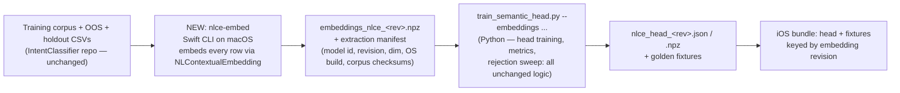

# Stage-3 Semantic Rescue on NLContextualEmbedding — Implementation & Evaluation Plan

**Status:** Plan — approved for build after review
**Scope:** Replace the bundled MiniLM-L6-v2 encoder in Stage 3 (semantic rescue)
with Apple's OS-provided `NLContextualEmbedding` on iOS — at the same
engineering rigor as the existing Python↔iOS S3 stage: mirrored
implementations, golden-fixture parity tests, holdout benchmarks, and
versioned artifacts.
**Related:** [WHY_CUSTOM_ML_OVER_PLATFORM_MODELS.md](./WHY_CUSTOM_ML_OVER_PLATFORM_MODELS.md) §"the platform component we can use on our terms" ·
[FM_VS_CASCADE_PRODUCTION_REPORT.md](./FM_VS_CASCADE_PRODUCTION_REPORT.md) ·
[semantic-understanding-ios-plan.md](./semantic-understanding-ios-plan.md) (original MiniLM S3 plan)

---

## 1. Why this project

`NLContextualEmbedding` (Natural Language framework, iOS 17+) is a BERT-based
sentence embedder hosted by the OS. Unlike Foundation Models it has **no
Apple Intelligence gate**: no A17 Pro floor, no user toggle, no regional
rollout — it runs on every device this app supports. It is an *embedder*,
the same architectural role MiniLM plays today, so it slots into our
"frozen encoder + our own trained head" design without surrendering
ownership of classification, confidence, or thresholds.

What we stand to gain on iOS:

| Pain today (measured) | With NLCE |
|---|---|
| MiniLM ≈ **100 MB resident** after ANE load; ~65 MB non-reclaimable floor (see `project-memory/performance_report.md`) | Model hosted in the OS process, not ours — app-attributed footprint expected to drop dramatically (to be measured with `MemoryProbe`, §5.4) |
| **22 MB** MiniLM + vocab in the app bundle | Encoder leaves the bundle; only our head (~100 KB) ships |
| One English encoder; multilingual = ship more encoders | One Latin-script model covers ~20 languages (incl. da/fr/de + future fi/pl/hu/tr/id); Cyrillic + CJK models extend further |

What we explicitly keep: **the head is ours** — trained on our data, with the
learned out-of-scope class, the 0.55 gate, and the same evaluation
discipline. This plan changes the encoder underneath it, nothing above it.

Non-goals: replacing Stage 1/2; touching Android (keeps MiniLM — see §8, risk 5);
replacing MiniLM on iOS outright (it remains the bundled fallback, §4.2).

---

## 2. Reference: what S3 is today (the bar this must meet)

| Layer | Python (source of truth) | iOS mirror | Parity mechanism |
|---|---|---|---|
| Tokenise + embed | `scripts/nlu/semantic.py` (`_tokenise`, `_embed_onnx`), max_len, mean-pool over attention mask, L2-norm | `SemanticEmbedder.swift` — comments mirror the Python function-for-function | Same math, verified by fixtures |
| Head | `train_semantic_head.py` → `semantic_head.npz/json` (logistic head, learned OOS class) | `SemanticClassifier.swift` (CoreML `SemanticHead.mlpackage`, Swift-weights fallback), threshold 0.55 | `coreml_golden_fixtures.json`, ±0.01 tolerance tests |
| Evaluation | `semantic_holdout_2.csv` — 341 utterances, 59 intents; leakage guard | Same CSV bundled for the FM benchmark | One holdout, every implementation graded on it |
| Artifacts | checksummed in `models/manifest.json` | copied verbatim into bundle | checksum + conformance test |

Every row of that table must have an equivalent in the NLCE version. That is
what "same level as the Python S3 stage" means concretely.

---

## 3. The one hard problem: training the head requires Apple's embeddings

The head must be trained on vectors from the **same encoder that runs on
device**. MiniLM runs anywhere (ONNX), so today the whole pipeline lives in
Python. `NLContextualEmbedding` **only runs on Apple platforms** — Python
cannot produce its vectors. The pipeline therefore gains one macOS step:



Design rules for that step:

- **The CLI is dumb on purpose.** It tokenises nothing, decides nothing —
  it feeds each CSV row to `NLContextualEmbedding` and writes vectors. All
  intelligence (capping, leakage guard, OOS handling, metrics) stays in the
  existing Python trainer, which gains only an `--embeddings <file>` input
  mode bypassing its ONNX embedding step.
- **Every embedding file carries a manifest**: embedding model identifier,
  **revision**, dimension, macOS/OS build, and SHA-256 of the input CSVs —
  the same checksum discipline as `models/manifest.json`. A head is only
  valid paired with the revision it was trained on (§6).
- **Determinism check at extraction time**: the CLI embeds a 10-sentence
  probe set twice and asserts identical output before processing the corpus.

---

## 4. iOS implementation

### 4.1 New files (mirroring the S3 pattern, additive only)

| File | Role |
|---|---|
| `Services/NLCESemanticEmbedder.swift` | Counterpart to `SemanticEmbedder`: async `embed(_ text:) -> [Float]?`. Wraps `NLContextualEmbedding` lookup (by language), `hasAvailableAssets` / asset request, revision query, and produces the sentence vector (mean-pooled to match the extraction CLI — the CLI and this class must mirror each other the way `semantic.py` and `SemanticEmbedder.swift` do today, comment-for-comment). Returns nil (Stage 3 skipped / fallback) when assets or revision don't match — never blocks a turn on a download. |
| `Services/NLCESemanticClassifier.swift` | Thin variant of `SemanticClassifier` loading `nlce_head_<rev>.json`; same `classify(_ embedding:) -> (label, confidence)` shape, same 0.55 threshold, same learned-OOS contract. (If dims match the CoreML head-export path, reuse `SemanticHead`-style mlpackage; else the Swift-weights path is sufficient — the head is a single matrix multiply.) |
| `Resources/NLCE/nlce_head_<rev>.json` (+ fixtures) | Head weights + golden fixtures per supported embedding revision. |
| `STTTests/NLCESemanticParityTests.swift` | The conformance gate (§5.2). |

### 4.2 Selection & fallback chain (the load-bearing design decision)

`IntentClassifierService.loadStage3()` gains a preference order — **behavior
never regresses below today's**:

```
1. NLCE assets present AND revision has a matching bundled head
       → Stage 3 runs on NLCE           (goal state)
2. NLCE unavailable (no assets yet / unknown new revision / API error)
       → Stage 3 runs on bundled MiniLM (exactly today's path)
3. Neither (MiniLM artifacts stripped in some future slim build)
       → Stage 3 skipped                (existing nil-init contract)
```

Rule 2 is why an OS update can never break us: an unrecognized revision
falls back to MiniLM the moment it appears, and telemetry flags that a new
head needs training (§6). Asset download is requested opportunistically at
Stage-3 load, never awaited during a user turn.

### 4.3 What does not change

`IntentClassifierService` cascade logic, the 0.55 gate, `NLUEngine`,
Stage 1/2, the FM sample, and all Python training semantics. The embedder
swap is invisible above the `SemanticEmbedder`-shaped seam — same
integration philosophy as the FM sample's `IntentClassifying` swap.

---

## 5. Testing — mirrored on the existing S3 parity suite, layer by layer

### 5.1 Extraction determinism (macOS, CI-able)
Same corpus row embedded twice → identical vectors; manifest checksums match
inputs. Guards the new pipeline step itself.

### 5.2 Head parity — Python ↔ iOS golden fixtures
Exactly the `IntentClassifierCoreMLParityTests` pattern: the Python trainer
exports N fixture rows (utterance → embedding → head logits → label +
confidence); the iOS test feeds the same embeddings through
`NLCESemanticClassifier` and asserts label equality and confidence within
**±0.01** — the same tolerance the existing S3/S2 conformance uses. This
isolates head math from encoder behavior.

### 5.3 Encoder parity — CLI ↔ device
New test class (no MiniLM equivalent existed because ONNX ran identically
everywhere; NLCE needs it): embed the 10-sentence probe set on-device,
compare against CLI-produced vectors from the same revision — cosine
similarity ≥ 0.999 per sentence. Catches platform/OS numerical divergence
and wrong-revision pairing in one test.

### 5.4 The head-to-head against Python MiniLM S3 (the decision test)
Run the full **341-utterance / 59-intent holdout** through both Stage-3
stacks and compare like-for-like:

| Metric | MiniLM S3 (current baseline) | NLCE S3 must be |
|---|---|---|
| Holdout accuracy (full system) | 89.4% | **≥ 89.4%** — no regression, or the project stops here |
| S3-only rescue quality (subset S2 fails on) | measured at eval time | ≥ MiniLM's on the same subset |
| OOS rejection (learned class + 0.55 gate) | measured at eval time | ≥ MiniLM's |
| S3 latency | ~8–10 ms | Report actual; no hard bar, must stay conversational (<50 ms) |
| App-attributed memory (MemoryProbe, same protocol as the 2026-06 investigation) | ~100 MB resident / 65 MB floor | **Materially lower — this is the point.** Measure phys_footprint before/after S3 load on both stacks |

Bars fixed now, before numbers exist — same discipline as the FM benchmark.
Per-intent breakdown required (no averaging away tail-class regressions —
the `DATA_CORRECTION_PLAN` lesson).

### 5.5 Regression net
Existing suites (keyword, S2 conformance, engine smoke tests) must stay
green — the diff should be structurally incapable of affecting them, and CI
proves it.

---

## 6. Revision drift protocol (the NLCE equivalent of §6 in the rationale doc)

The embedding model updates with the OS. Unlike the Foundation Models prompt
case, **the version is explicitly queryable** — so drift is engineerable:

1. On Stage-3 load, read the embedding revision. Matching bundled head →
   NLCE path. No match → MiniLM fallback + one telemetry/log event
   ("unseen NLCE revision R on OS build B").
2. On each new OS beta: run `nlce-embed` on the new revision → retrain head
   (minutes — the corpus and trainer are unchanged) → run the §5 suite → add
   `nlce_head_<newRev>` to the next app release. Old heads retained while
   fleet OS versions overlap.
3. This is a **treadmill, honestly stated** — the same class of obligation
   Apple's adapter toolkit imposes (retrain per model version). We accept it
   here and not for adapters because the unit of work is minutes-not-days,
   the artifact is ~100 KB-not-160 MB, failure degrades to MiniLM instead of
   a broken feature, and the win (≈100 MB memory + multilingual scaling) is
   concrete.

---

## 7. Phases

| Phase | Deliverable | Effort |
|---|---|---|
| 0 | `nlce-embed` Swift CLI + extraction manifest + determinism check; embed full corpus on current revision | 1–1.5 d |
| 1 | `train_semantic_head.py --embeddings` mode + fixtures export; train first NLCE head; **offline holdout comparison vs MiniLM head (kill-gate: §5.4 accuracy bar)** | 1 d |
| 2 | iOS `NLCESemanticEmbedder` + `NLCESemanticClassifier` + fallback chain wiring | 1.5–2 d |
| 3 | Parity suites 5.2/5.3 + on-device holdout run + MemoryProbe before/after comparison | 1 d |
| 4 | Findings write-up: accuracy, latency, memory, revision protocol validated on one OS beta cycle → go/no-go for shipping NLCE-first | 0.5 d |

Phase 1 is deliberately the kill-gate: if the NLCE-based head can't match
MiniLM's accuracy *offline on a Mac*, we stop before writing any iOS code.

---

## 8. Risks & open questions

| # | Risk | Mitigation |
|---|---|---|
| 1 | NLCE embedding quality on our short command utterances underperforms MiniLM (it's tuned for general text) | Phase-1 kill-gate measures exactly this before iOS investment |
| 2 | Asset download absent on fresh offline installs | MiniLM fallback is permanent; NLCE is an upgrade path, not a dependency |
| 3 | OS revision arrives before we ship its head | Fallback + telemetry (§6.1); user sees today's behavior, never breakage |
| 4 | Sentence-vector extraction details (pooling, token handling) differ subtly between our CLI and on-device calls | §5.3 encoder-parity test exists precisely for this; CLI and embedder class are mirror-commented like `semantic.py` ↔ `SemanticEmbedder.swift` |
| 5 | **Android divergence**: Android keeps MiniLM → S3 encoders differ per platform; byte-level cross-platform parity for S3 is gone | Accepted and documented: parity contract for S3 shifts from "same numbers" to "same holdout bars per platform," each platform with its own golden fixtures. S1/S2 numerical parity untouched |
| 6 | Language coverage: no Arabic/Thai/Greek script models | Same fallback rule per language; multilingual rollout table gates on script support |
| 7 | Memory win smaller than hoped (NL framework may still allocate in-process) | MemoryProbe comparison in Phase 3 is a measured go/no-go input, not an assumption |

---

## 9. Success criteria (all measured, none aspirational)

1. Holdout ≥ 89.4% with NLCE S3 (no system-level regression), per-intent
   table reviewed.
2. Golden-fixture parity within ±0.01; encoder parity ≥ 0.999 cosine.
3. App-attributed Stage-3 memory reduced vs. MiniLM baseline by a margin
   that justifies the revision treadmill (target: ≥ 60 MB reclaimed).
4. Revision-fallback path demonstrated live (simulate unknown revision →
   MiniLM path engages, no user-visible change).
5. One full retrain-on-new-revision cycle executed end-to-end in under a
   day, documented as the runbook.
