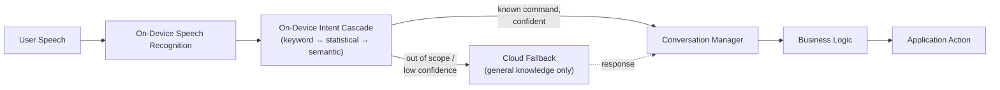

# On-Device Intent Classification — Executive Overview

**Author:** Principal Engineering Review
**Audience:** Engineering leadership, Product, Architecture Review Board
**Status:** iOS shipped · Android planned · Multilingual in progress
**Companion document:** [ON_DEVICE_NLU_TECHNICAL_DETAILS.md](./ON_DEVICE_NLU_TECHNICAL_DETAILS.md) — implementation-level detail for engineers evaluating or extending this system

---

## 1. Executive Summary

Every voice command in the app today is classified by sending the user's speech, as text, to Dialogflow — a cloud NLU service — and waiting for a response before anything happens. This works, but it has two structural costs: it does not function without connectivity, and it is billed per classification, currently **$3,099/month**, scaling upward with adoption.

We built a replacement: an **on-device intent classification pipeline** that takes speech from a known, closed set of roughly 60 in-app commands (volume control, reminders, translation, memory changes, and similar) and classifies it entirely on the phone — no network call, no per-request cost, no dependency on connectivity. Cloud is not removed from the system; it is demoted from "every request" to "only the requests that are genuinely outside what the app already knows how to handle," such as open-ended general-knowledge questions.

This is not a cost-cutting shortcut. It is a deliberate architectural choice, validated against a full evaluation holdout, and it is live and running on iOS today.

---

## 2. The Problem

Every command — regardless of whether it is something the app has handled a thousand times before, like "turn up the volume," or something genuinely novel — takes the same round trip. Two consequences follow directly from that:

- **No connectivity, no functionality.** This is a hearing-aid companion app. Users depend on it in places where connectivity is not guaranteed. When the network call fails, classification does not degrade — it stops working entirely.
- **Cost scales with success.** The more adoption grows, the larger the monthly bill grows, indefinitely, for a workload that — for the large majority of requests — does not require general-purpose language understanding at all, just recognition of a fixed, known vocabulary of commands.

---

## 3. The Solution, At a Glance

Speech recognition, classification, and the resulting action all run on-device, using Apple's on-device speech APIs and a purpose-built classification cascade we trained ourselves. The cloud path still exists — but only as the exit taken when a request is genuinely outside the closed set of commands the app knows about (e.g. "what's the weather today"), not as the default path for everything.

Full stage-by-stage detail, including the internal structure of the classification cascade, is in the [technical details document](./ON_DEVICE_NLU_TECHNICAL_DETAILS.md).

---

## 4. Where This Architecture Is Strongest

This is not a claim that on-device is universally superior to cloud NLU — it is a claim that it is the correct tool for *this specific problem*: a closed, known set of commands in a product where reliability and cost predictability matter more than open-ended language flexibility.

- **Offline reliability.** The core feature of the app functions with zero connectivity. For a hearing-aid companion, this is not a convenience — it's closing a gap where the product's primary interaction could otherwise fail silently at the moment a user needs it most.
- **Cost structure.** Classification cost is fixed at the engineering investment already made; there is no per-request billing for the on-device path, regardless of how much adoption grows.
- **Latency.** The classification cascade itself resolves in single-digit milliseconds. The dominant contributor to perceived response time is speech endpoint detection (deciding the user has finished talking), not classification — and that stays true whether classification happens on-device or in the cloud.
- **Determinism and auditability.** The same input reliably produces the same output. Every shipped model is versioned and checksummed. For a product adjacent to a regulated medical device category, being able to say precisely which model, with which accuracy, was running at a given time is a meaningful property — not a detail.
- **Privacy.** Raw speech never leaves the device by default for the closed command set — text derived from it is processed locally, and nothing is sent externally unless a request is explicitly routed to the cloud fallback.

---

## 5. The Machine Learning Techniques We Used, and Why

Classification is not a single model — it is a **three-tier cascade**, where each tier only runs if the one before it was not confident enough. This matters for both speed and accuracy: the majority of requests resolve at the cheapest, fastest tier, and progressively more powerful (and more expensive) techniques are reserved for the harder cases.

| Tier | Technique | What it does | Why this technique |
|---|---|---|---|
| 1 | **Keyword rules** | Fast, declarative pattern matching (exact / contains / regex) against known trigger phrases, with negation-awareness so "I don't want to translate this" doesn't misfire | Effectively free (near-zero latency) and catches the clear, unambiguous cases immediately — no reason to invoke a model when a rule confidently answers the question |
| 2 | **TF-IDF + Logistic Regression** — *trained by us, from scratch, on our own data* | Converts an utterance into a weighted representation of which words are distinctive versus common, then a trained classifier scores it against all known commands | A well-proven, lightweight technique for closed-vocabulary classification; the exported model is roughly **16 KB** and runs in low single-digit milliseconds — no case for a heavier model when the domain is this well-defined |
| 3 | **MiniLM-L6-v2 (pre-trained, frozen) + a linear classification head we trained ourselves** | Converts an utterance into a numerical representation of its *meaning*, so phrasings never seen in training — "it's too quiet," "boost sound" — still resolve correctly if they mean the same thing as something the model does know | Reserved for the harder ~10% of requests that don't resolve confidently at Tier 2; we did not train a language-understanding model from scratch — we responsibly reused a well-tested, open, pre-trained encoder and trained only the small classification layer specific to our domain on top of it |

A precise distinction worth stating plainly: **Tier 2 is fully our own trained model** — every weight came from our own labeled data. **Tier 3 reuses a pre-trained, third-party encoder** and adds our own trained layer on top of it. Both are legitimate, standard practice; conflating them would misstate what was built.

Only if all three tiers fail to reach a confident answer does the system fall back to the cloud.

**Validation:** the production classifier is evaluated against a held-out test set spanning all 59 supported intents (not a subset), and currently scores **89.4% holdout accuracy** — measured honestly, after an earlier gap where our first holdout set covered only 10 of 59 intents was identified and corrected.

---

## 6. How This Compares to the Alternatives

Two cloud-based approaches are relevant to this decision: **Dialogflow**, the system in place today, and **Azure OpenAI**, which has also been proposed as an option. Both are addressed here directly rather than only comparing against the one being replaced.

| | On-Device (what we built) | Dialogflow (current) | Azure OpenAI API (proposed alternative) |
|---|---|---|---|
| Where it runs | On the device | Microsoft/Google cloud | Microsoft cloud |
| Works offline | **Yes** | No | No |
| Cost model | Fixed engineering cost, then free per request | Pay per request — currently $3,099/mo, scales with usage | Pay per request, typically higher per-call cost than Dialogflow, scales with usage |
| Latency | Single-digit milliseconds | Network round-trip (hundreds of ms+) | Network round-trip, often slower — hundreds of ms to a few seconds |
| Determinism | Same input → same output, always | Generally consistent | Can vary between calls unless carefully constrained with structured output settings |
| Requires training | Yes — but ours: ~16 KB and ~22 MB models, fully owned and versioned | No — managed by Google | No traditional training job — but relies on prompt design, and the underlying model is trained, owned, and versioned by Microsoft, not us |
| Who controls the model | Us — versioned, tested, checksummed | Google | Microsoft — can update or deprecate the underlying model independently of our release cycle |
| Best fit | The closed set of ~60 known in-app commands | *(being replaced)* | Genuinely open-ended queries outside the known command set — a candidate for the cloud-fallback role in the architecture above, not a replacement for the on-device tiers |

The conclusion this table supports is not "cloud is bad" — it's that **general-purpose cloud language models, whichever vendor provides them, are the right tool for open-ended requests and the wrong tool for a fixed, closed set of commands we already know how to classify locally.** Our architecture reserves the cloud exit specifically for the former case.

---

## 7. Current Status

| Component | Status |
|---|---|
| iOS — full pipeline (ASR, classification cascade, conversation manager) | **Shipped and running** |
| Android | Not yet built. The training pipeline exports to a portable format (ONNX / Core ML) by design, so extending to Android is a native-integration effort, not a retraining effort |
| Cross-platform numerical parity testing | Test infrastructure exists and passes on the models validated so far; not yet wired into the main CI pipeline — in progress |
| Multilingual (French, German, Danish) | Native-speaker-reviewed language content approved; calibrated models trained and evaluated for all four languages (English, French, German, Danish) |

We would rather state these precisely than have a gap surface later in a review.

---

## 8. Roadmap

- Extend the shared pipeline to a native Android integration
- Wire cross-platform conformance testing into the main CI pipeline as a release gate
- Deepen semantic understanding and entity resolution accuracy
- Broaden multilingual coverage beyond the four languages currently trained

For the full technical breakdown — exact model configurations, latency and memory measurements, the conversation-manager design, training/evaluation methodology, and known engineering follow-ups — see **[ON_DEVICE_NLU_TECHNICAL_DETAILS.md](./ON_DEVICE_NLU_TECHNICAL_DETAILS.md)**.
