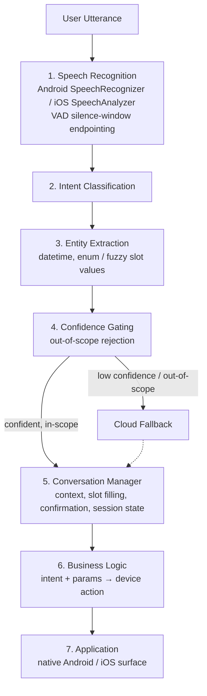
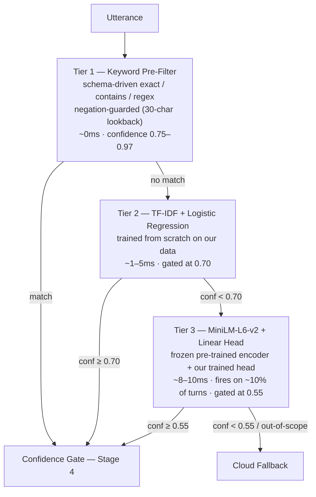
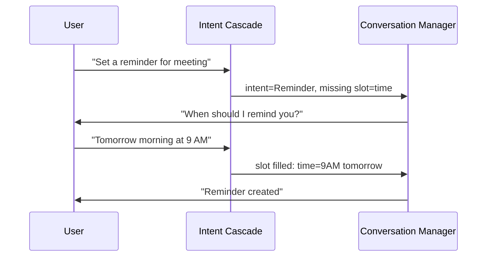
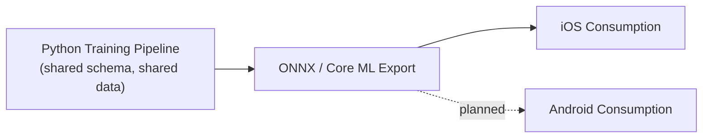

# On-Device Intent Classification — Technical Details

**Audience:** Engineers evaluating, extending, or maintaining this system
**Parent document:** [ON_DEVICE_NLU_OVERVIEW.md](./ON_DEVICE_NLU_OVERVIEW.md) — read that first for the business and architectural context this document assumes

---

## 1. Full Pipeline

Stage 4 (Confidence Gating) is the **only** exit to a network call. A request that stays low-confidence through all three internal classification tiers routes to cloud fallback — this is an offline-first design, not an offline-only one.

Endpoint detection in Stage 1 (deciding the user has finished speaking, typically 500ms–1000ms) is the dominant contributor to perceived latency end-to-end — substantially larger than the classification cascade itself (see §5).

---

## 2. Intent Classification — The Three-Tier Cascade

Stage 2 above is not one model. It is three tiers, each invoked only if the previous one did not reach its confidence threshold.

### Tier 1 — Keyword Pre-Filter

- Schema-driven rules (`nlu_schema.json`, keyword triggers) — exact match, contains, and regex tiers, each with its own confidence value (0.75–0.97 by match tier).
- **Negation-guarded:** a 30-character lookback window is scanned before a "contains" match fires, so "I don't want to translate this" does not trigger `Cmd.TranslationStart`. Exact matches are immune to negation (the user said just that word/phrase, unambiguously).
- No ML — pure declarative rules. Effectively 0ms.

### Tier 2 — TF-IDF + Logistic Regression

- `TfidfVectorizer(ngram_range=(1,2), min_df=2, sublinear_tf=True)` feeding `LogisticRegression(C=15.0, class_weight="balanced")`.
- Trained on our own labeled data — close to **10,000 examples** across all 59 supported intents.
- Exported to ONNX with raw logits (`raw_scores=True`, `zipmap=False`); confidence is calibrated post-hoc via a single fitted temperature parameter `T` (rank-preserving softmax scaling), so a reported 90% confidence is empirically close to 90% accurate, not a raw uncalibrated score.
- Production model: `T = 0.7963`, gated at 0.70 confidence.
- Exported model size: **~16 KB**. Latency: ~1–5ms.

### Tier 3 — MiniLM-L6-v2 + Linear Head

- Frozen, pre-trained 6-layer MiniLM sentence encoder (384-dim, mean-pooled, L2-normalized) — **not trained by us**; this is a well-established open sentence-transformer model.
- A linear classification head trained SetFit-style **on top of** the frozen encoder, on our own 59-intent data, with an explicit out-of-scope class (`Default Fallback Intent`) trained on ~156 curated out-of-domain phrases — rejection is learned, not just thresholded.
- Gated at 0.55 confidence; fires on approximately 10% of turns (the cases Tier 2 wasn't confident enough to resolve alone).
- On-disk size: **22 MB**. Latency: ~8–10ms (tokenize ~1ms, ANE embedding ~6ms, head ~0.5ms).
- **Runtime memory note:** on-disk size understates in-memory cost for ANE-resident transformer weights. Measured on iOS, Stage 3 fully loaded adds roughly 100 MB of `phys_footprint` (weight replication and activation arenas for ANE execution), of which ~65 MB is a persistent floor that does not release until process termination. This is in the same class as Apple's own on-device Dictation/Siri footprint and has been evaluated as an acceptable tradeoff for this product; it is not reclaimable via lazy loading or teardown once paid, so it should be accounted for explicitly in memory budget discussions rather than assumed away by the 22 MB on-disk figure.

---

## 3. Training Data and Evaluation

- **Domain:** 59 intents, closed and fixed (volume control, reminders, translation, memory, activity/health queries, help topics, etc.).
- **Training set:** ~10,000 labeled utterances.
- **Holdout evaluation:** a dedicated 341-utterance holdout set spanning **all 59 intents** (not a subset) is used to measure production accuracy, with a leakage guard ensuring no out-of-scope phrase used for training also appears in holdout.
- **Current production holdout accuracy: 89.4%**, on the full 59-intent set.

This number carries a specific history worth documenting rather than omitting: an earlier holdout set covered only 10 of the 59 intents, with the other 50 completely unmeasured, and reported 60% accuracy on that partial view. That gap — plus class imbalance (a 100× range between the largest and smallest intent classes) and an undersized out-of-scope training set — was identified internally, and corrected through per-class data capping, hyperparameter retuning, out-of-scope set expansion, and a full-coverage holdout rebuild. The 89.4% figure is the result of that correction, measured honestly against all 59 intents. This is included here because *how* a metric was arrived at matters as much as the metric itself.

---

## 4. Conversation Manager (Stage 5)

State — which intent is pending, which slot is still awaited — lives in the conversation manager, not in the classifier. The classifier has no memory between turns.

Capabilities:

- **Context** — named, lifespan-scoped state (turn-counted, not wall-clock), e.g. an active confirmation.
- **Slot filling** — prompts for each missing required parameter in order.
- **Follow-up handling** — yes/no confirmation gate before consequential actions.
- **Session state** — per-session store, expires on inactivity.
- **Intent routing priority** — when multiple things are true at once (a pending confirmation *and* a new command arriving), priority order is: **confirmation > slot-filling > fresh classification.**

---

## 5. Latency Budget (End-to-End, User Speaks → First Action)

| Stage | Typical | Worst Case |
|---|---|---|
| STT endpointing (silence window) | 500ms | 1000ms |
| NLU classification cascade (Tiers 1–3 combined) | 10–20ms | 50ms |
| Downstream (business logic, teardown, response) | ~100–200ms | ~400ms |

Endpoint detection — deciding the user has finished speaking — dominates perceived latency by roughly an order of magnitude over classification itself. Any future latency optimization work should prioritize the endpointing window over further optimizing the classification cascade, which is already a minor contributor.

---

## 6. Deployment Pipeline

- One Python training pipeline, one shared intent/slot/keyword schema, drives model training for every target platform.
- Trained artifacts export to ONNX (portable) and Core ML (iOS-native); the same artifact ships to every platform rather than platform teams training separate models that can drift apart.
- **iOS**: fully integrated and running (`VoiceAIKit` Swift package).
- **Android**: no client implementation exists yet. Because the pipeline was deliberately built to export to a portable format rather than an iOS-specific one, this is scoped as a native-integration effort, not a retraining effort — but it should not be represented as already built.
- **Conformance testing**: `test_ios_conformance.py` validates ONNX-vs-on-device numerical parity within a ±0.01 tolerance; a corresponding iOS test target (`IntentClassifierCoreMLParityTests`) exists and passes against golden fixtures. This is currently gated to a feature branch and a cross-repo credential rather than running on every merge to main — treat "conformance in progress" as accurate until that's promoted into the primary CI pipeline.

---

## 7. Known Engineering Follow-Ups

Documented here deliberately, so they're tracked rather than discovered later:

1. **Two independent keyword-matching implementations** exist — a schema-driven matcher and a separate hardcoded Swift matcher (legacy path). These can drift out of sync if trigger rules are updated in one but not the other; should be consolidated to a single source of truth.
2. **Cloud fallback URL defaults to a placeholder** (`https://genai.yourcompany.com`) if the runtime configuration is not supplied. Low risk today since the fallback path is only reached for out-of-scope requests, but worth an explicit configuration-presence check before wider rollout.
3. **Conformance CI is not yet on the main pipeline** (see §6) — tracked as a release-gate item, not a correctness concern with the tests themselves.
4. **Android has no implementation** — tracked as the primary near-term scope item, not a gap in the current iOS release.

---

## 8. Where to Look in the Codebase

| Concern | Location |
|---|---|
| On-device ASR + endpointing | `STT/`, `VoiceAIKit/Sources/VoiceAIKit/Core/Audio` |
| Intent cascade (Swift, on-device) | `VoiceAIKit/Sources/VoiceAIKit/NLU/` (`KeywordMatcher.swift`, `TFIDFLogisticScorer.swift`, `SemanticClassifier.swift`) |
| Conversation manager | `VoiceAIKit/Sources/VoiceAIKit/NLU/Engine/` (`NLUEngine.swift`, `NLUContext.swift`) |
| Training pipeline (Python) | `IntentClassifier/scripts/` (`train.py`, `train_semantic_head.py`, `predict.py`, `auto_label.py`) |
| Shared schema | `IntentClassifier/data/nlu_schema.json` and per-language variants under `VoiceAIKit/Sources/VoiceAIKit/Resources/Localization/` |
| Model artifacts + manifest | `IntentClassifier/models/`, `IntentClassifier/models/manifest.json` |
| Cross-platform conformance tests | `IntentClassifier/scripts/test_ios_conformance.py`, `STTTests/IntentClassifierCoreMLParityTests.swift` |
