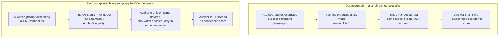
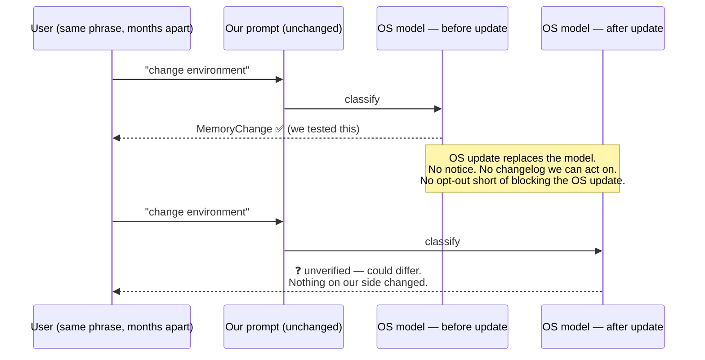

# Why We Built Our Own Classifier Instead of Using the Platforms' Built-In AI Models

**Author:** Principal Mobile Engineering (iOS + Android ML)
**Audience:** Engineering, Product, and Leadership — written to be readable end-to-end by any technical person; examples and diagrams included where concepts get deep.
**Companion documents:** [FM_VS_CASCADE_PRODUCTION_REPORT.md](./FM_VS_CASCADE_PRODUCTION_REPORT.md) (the production decision) · [FM_SAMPLE_PLAN.md](./FM_SAMPLE_PLAN.md) (the working iOS prototype we built to test all of this)

---

## 1. The decision in one paragraph

Both Apple and Google now ship a general-purpose AI model inside the operating
system (Apple's Foundation Models on iOS, Gemini Nano on Android). The obvious
question — asked twice by reviewers of our earlier documents — is: *"those are
already trained and available; couldn't they do intent classification with the
right prompt?"* We took the question seriously enough to **build a full working
prototype on iOS and test it on real devices** before answering. The answer:
yes, they can do the task — and no, they cannot be the foundation of this
product. They run only on premium recent hardware, they can be switched off by
the user at any time, they give us no confidence score to gate actions on, they
answer in ~1 second where our model answers in ~5 milliseconds, and — proven
below with the platforms' own documentation — **their behavior can change
underneath us whenever the OS updates the model, without any change on our
side.** Our own trained classifier has none of these problems, runs on every
device we support on both platforms, and ships at **under 1 MB**.

---

## 2. Primer: the two approaches (for readers new to this)

There are two fundamentally different ways to turn *"turn it up a bit"* into
the command `VolumeIncrease`:

**A useful analogy for the rest of this document:** our model is a *trained
specialist* — it knows exactly 60 things and knows them cold. The platform
model is a *brilliant generalist contractor* — very capable, but we don't
employ them: Apple/Google do. The contractor doesn't work on older buildings
(devices), can be told by the homeowner not to come in (the AI toggle), never
tells you how sure they are, and — critically — **can be replaced by a
different contractor overnight without telling us**, one who reads our same
written instructions slightly differently.

---

## 3. We didn't guess — we built it

To keep this document honest, everything below about platform-model behavior
comes from one of two places: the platforms' own documentation (linked), or
**our own working prototype** — a complete Foundation Models intent
classifier integrated into the iOS app (branch `claude/fm-intent-sample`,
folder `STT/STT/Services/FoundationModelNLU/`), run on a physical eligible
device. Findings from those runs appear below marked **[field-tested]**.

---

## 4. iOS — the complete issue inventory (Apple Foundation Models)

Every issue we identified, including the small ones:

### 4.1 Hardware floor
Requires Apple Intelligence-class silicon — A17 Pro or later. **The base
iPhone 15 and 15 Plus do not qualify** (they carry the A16); only the 15
Pro/Pro Max and later generations do. Every iPhone 14 and older: never
eligible. Our users hold phones longer than average; a large share of the
fleet can never run this path.
→ [Apple: How to get Apple Intelligence](https://support.apple.com/en-euro/121115)

### 4.2 The user can turn it off — at any time
Apple Intelligence is an opt-in toggle in Settings. Users can decline it at
setup or disable it later — **including while our app is running**. Corporate
MDM policy can force it off on managed devices. A capability that a Settings
switch can revoke mid-session cannot carry a core feature of a hearing-aid
companion app.

### 4.3 Regional and language gates
Rollout is staged by region (the EU and China have had distinct timelines).
The device language must be on Apple's supported list — 16 languages as of
iOS 26.1. Mapped against our app's 23 localizations: **15 covered, 8 not**
(Arabic, Finnish, Greek, Hungarian, Indonesian, Polish, Russian, Thai — no
announced timeline). A brand-new iPhone set to Polish reports the model as
unavailable.
→ [Apple Newsroom: Apple Intelligence language expansion](https://www.apple.com/in/newsroom/2026/06/apple-intelligence-brings-powerful-ai-capabilities-into-everyday-experiences/)

### 4.4 "Model not ready" states
Even on an eligible, enabled device the model can be temporarily absent:
first-time asset download, re-download after an OS update, or system asset
maintenance. Any integration must treat availability as a per-turn check,
not a launch-time fact.

### 4.5 No confidence score — the deepest technical problem
The framework returns an answer but **no probability** (no logprobs). Our
entire safety design rests on calibrated confidence: when our model says
"92% sure it's VolumeIncrease," that number is empirically true (temperature
scaling, validated on holdout), and actions are gated on it. The platform
model gives us nothing to gate on. **[field-tested]** We asked the model to
self-rate; it reported ≈1.0 confidence on nearly every answer — *including
every single one of its wrong answers.*

> **For non-ML readers:** imagine two employees. One says "I'm 60% sure —
> double-check me" when uncertain; you can build a process around that. The
> other answers everything with total confidence, right or wrong. The second
> employee is unusable for decisions with consequences — not because they're
> often wrong, but because you can never tell *when*.

### 4.6 Latency — ~100× slower
**[field-tested]** ~800–950 ms per classification (after our optimizations),
versus 2–5 ms for our model. Acceptable for an occasional fallback turn;
not for the primary path of every single voice command.

### 4.7 Session memory contaminates classification
**[field-tested]** The framework's sessions remember the conversation. In
our first runs, per-turn latency grew from 791 ms to 2,847 ms across eight
turns, the context filled up and overflowed — and worst, **the identical
phrase "Change memory" classified correctly on turn 1 and incorrectly on
turn 3**, because the model was reading the repeat against its accumulated
history. We fixed this with a fresh-session-per-turn design, but it is a
sharp edge every integrator will hit.

### 4.8 Small context window
The on-device model's context is 4,096 tokens. Our 60-command catalog
consumes ~1,100 of them on every single request — a real budget, actively
managed, and a hard ceiling on how much instruction detail we can add.

### 4.9 Guardrail refusals
The framework has a built-in safety layer that can refuse a prompt or a
response entirely (`guardrailViolation`). Our domain touches hearing and
health topics, so refusals are not hypothetical — and a refusal arrives as
an error we must silently absorb into a fallback.

### 4.10 Rate limits
The system enforces request rate limits (strictest for background use). A
chatty voice session shares the model with every other app on the device.

### 4.11 A 3-billion-parameter model still makes basic domain errors
**[field-tested]** "I sat at a busy cafe" → classified as a step-count
command. "Crowd" (a hearing-aid program name the user was answering with) →
step-count command. "Change environment" (normal hearing-aid vocabulary) →
not recognized until we taught the prompt the synonym. Each fix was cheap —
but each error was found *by a human noticing*, because (see 4.5) the model
flags nothing itself.

### 4.12 Deterministic — but only within one model version
Greedy decoding makes output reproducible for the same prompt *on the same
model version*. Across model versions there is no such promise — see §6,
which answers this document's central question.

### 4.13 No pinning, no rollback
We cannot pin the model version, hold one back, or roll back after a bad
update. Model version is welded to OS version. Our own models are
checksummed per release (`manifest.json`) with full rollback.

### 4.14 iOS 26+ only
The framework itself requires iOS 26 — a second gate on top of hardware,
for any user who hasn't updated.

### 4.15 Testing burden
Our QA matrix would gain three new axes: device eligibility × Apple
Intelligence on/off × OS model version. Today's classifier behaves
identically everywhere, so none of those axes exist.

---

## 5. Android — the complete issue inventory (Gemini Nano)

The same architectural idea exists on Android — and every iOS concern has an
Android twin, usually worse:

### 5.1 Flagship-only device list
Gemini Nano runs via **AICore** on a short list of premium devices: Pixel 8
onward, Samsung Galaxy S24 onward and recent Z-foldables, and select
flagships from Xiaomi, Motorola, and OnePlus. **The Android mid-range —
where a large share of real users live — has no access at all.** iOS at
least converges (every new iPhone qualifies); Android's long tail of
mid-range and OEM-fragmented devices means this gap persists for years.
→ [Android Developers: Gemini Nano](https://developer.android.com/ai/gemini-nano)

### 5.2 Fragmentation on top of eligibility
Unlike Apple's single hardware line, AICore spans Google Tensor, Qualcomm
Snapdragon, and MediaTek Dimensity silicon — and **which model version and
which features a device gets varies by OEM and chipset** (newer Pixels run
newer Nano versions with different capabilities). "Supported" is not one
experience; it's a matrix.
→ [ML Kit GenAI APIs overview](https://developers.google.com/ml-kit/genai)

### 5.3 The developer API is task-shaped, not classifier-shaped
Third-party access is primarily through ML Kit's GenAI APIs — high-level
tasks (summarize, proofread, rewrite, describe image) plus a general Prompt
API. There is no equivalent of Apple's guided generation forcing output into
our exact 60-case enum, so output-format discipline falls back on prompt
engineering and response parsing — the fragile pattern guided generation
exists to eliminate.
→ [Android Developers Blog: ML Kit GenAI APIs](https://android-developers.googleblog.com/2025/05/on-device-gen-ai-apis-ml-kit-gemini-nano.html)

### 5.4 No confidence score here either
Same gap as iOS (§4.5), same consequence.

### 5.5 Google owns the model lifecycle
Gemini Nano updates arrive through AICore/Play services — **independently of
app releases and without our involvement**. Same drift problem as iOS (§6),
delivered on a different vendor's schedule. Running both platform models in
production would mean monitoring **two independent, unsynchronized drift
surfaces**.

### 5.6 Cross-platform answers would disagree
Apple's model and Google's model are different models with different
training. The same user utterance could classify differently on iPhone vs.
Android — an inconsistency our current architecture makes impossible: **the
same trained artifact, byte-for-byte, ships to both platforms**, and our
conformance tests verify numerical parity.

### 5.7 The toggle and download states exist here too
AICore features require the device AI stack enabled and model assets
downloaded; managed-device policy applies on Android as well.

---

## 6. The question asked directly: "if Apple/Google update the model, could our prompt's output change?"

**Yes. Unambiguously. And we don't have to speculate — the platforms'
own developer documentation proves it.**

### The proof, from Apple's own toolkit

Apple publishes an adapter-training toolkit for developers who want to
specialize the on-device model (details in §7). Its documentation states
that **each toolkit version contains model assets tied to a specific OS
version range, and an adapter must be retrained for every system model
version — no exceptions.**
→ [Apple Developer: Foundation Models adapter training](https://developer.apple.com/apple-intelligence/foundation-models-adapter/)

Read what that requirement admits: if the base model were stable across OS
updates, one adapter would keep working. Apple mandates retraining *because
the underlying model genuinely changes* with OS releases. An adapter is a
precision attachment to the model's internals; a prompt is an instruction
sheet handed to the same internals. **A model change big enough to
invalidate a trained adapter is a model change big enough to shift how a
prompt is interpreted.** Google's equivalent signal: their guidance on
prompt quality for Gemini Nano is delivered per-model via automated prompt
optimization tooling — prompts are tuned *to a model version*.
→ [Android Developers Blog: Automated Prompt Optimization for the Prompt API](https://android-developers.googleblog.com/2026/01/how-automated-prompt-optimization.html)

### What this means concretely

> **For leadership, the one-sentence version:** with the platform model, we
> can test everything perfectly today and still be wrong next quarter,
> because the thing we tested gets swapped out underneath us. With our own
> model, behavior changes only when *we* ship a change — tested, versioned,
> and reversible.

The only defense is detection: re-run our 341-utterance benchmark on every
OS release, forever, on both platforms. That is a permanent monitoring tax —
acceptable for a small auxiliary role, disqualifying for the core path.

---

## 7. "Can't we train the platform models ourselves?" — investigated

### iOS: yes, via Apple's Adapter Training Toolkit — with heavy strings attached

Apple supports specializing the on-device model with **LoRA adapters**
(small add-on weight layers trained on your data while the base model stays
frozen). The toolkit is Python/PyTorch-based, requires an Apple Developer
Program membership, and community documentation reports adapters at roughly
**~160 MB each**, delivered to devices via the Background Assets framework.
→ [Apple Developer: Foundation Models adapter training](https://developer.apple.com/apple-intelligence/foundation-models-adapter/) ·
[Practitioner guidance: when to train an adapter](https://blakecrosley.com/blog/foundation-models-custom-adapters) ·
[Community toolkit wrapper (AFMTrainer)](https://github.com/scouzi1966/AFMTrainer)

**The effort — item by item, compared with what we already do:**

| Step | Our pipeline | Apple adapter route |
|---|---|---|
| Collect + label training data | Required (done — ~10k examples) | **Required — the identical work** |
| Training infrastructure | scikit-learn, minutes on a laptop | PyTorch + GPU training runs |
| Evaluation / holdout discipline | Required (done — 341-utterance set) | **Required — the identical work** |
| Shipped size | **< 1 MB** (core classifier) | **~160 MB per adapter** |
| Delivery | In the app bundle | Background Assets download infra |
| When the vendor updates the model | Nothing happens — our model is ours | **Retrain, re-validate, re-ship the adapter for every OS model version — mandated by Apple** |
| Device coverage after all that work | Every supported device | Still only A17 Pro+ with AI enabled |
| Confidence score after all that work | Calibrated, gateable | **Still none** |

The punchline is the bottom half of the table: the adapter route requires
**all the data and evaluation work our approach already requires**, then
adds a GPU training stack, a 160 MB download per user, a vendor-mandated
retraining treadmill synchronized to Apple's OS schedule — and at the end,
the result still runs on fewer devices than what we ship today, still
without a confidence score. Training the platform model doesn't remove our
ML work; it **duplicates it inside a rented house**.

### Android: technically announced, practically constrained

Google announced LoRA fine-tuning support for Gemini Nano through AICore in
December 2023. In practice, the mainstream third-party path (ML Kit GenAI
APIs) is prompt-only, and Google's own January 2026 guidance acknowledges
that deploying per-app custom adapters on a shared system model "comes with
challenges," steering developers instead toward **prompt optimization** —
i.e., not training at all. Whatever the eventual maturity of per-app
adapters, every structural issue in §5 (device list, fragmentation, vendor
lifecycle, no confidence) survives fine-tuning untouched.
→ [Android Developers Blog: A New Foundation for AI on Android (AICore + LoRA announcement)](https://android-developers.googleblog.com/2023/12/a-new-foundation-for-ai-on-android.html) ·
[Android Developers Blog: Automated Prompt Optimization](https://android-developers.googleblog.com/2026/01/how-automated-prompt-optimization.html)

---

## 8. Conclusion — why our approach won

| What matters for this product | Platform models (both) | Our classifier |
|---|---|---|
| Runs for every user, every device, both platforms | ❌ | ✅ |
| Immune to a user/MDM toggle | ❌ | ✅ |
| Calibrated confidence to gate actions | ❌ | ✅ |
| Millisecond latency on the hot path | ❌ (~1 s) | ✅ (2–5 ms) |
| Behavior changes only when we ship | ❌ (proven, §6) | ✅ |
| Identical answers on iOS and Android | ❌ (two different models) | ✅ (same artifact) |
| Any language we can collect data for | ❌ (vendor's list) | ✅ |
| Shipped size | 0 (OS-hosted) / ~160 MB if adapter-trained | **< 1 MB core** |

The platform models are genuinely impressive engineering, and this document
is not a dismissal — we keep exactly one future role open for them:
answering the **out-of-scope fallback turns** (where our classifier has
already said "I don't know"), on devices where they happen to be available,
gated behind the runtime availability check, held to our benchmark bars, and
re-verified on every OS release. Everything on the primary path — every
known command, every user, every device, both platforms — runs on the model
we own: trained on our data, validated on our holdout, calibrated, versioned,
reversible, and under 1 MB.

---

## Appendix: source list

**Apple**
- [How to get Apple Intelligence (device/eligibility)](https://support.apple.com/en-euro/121115)
- [Apple Newsroom — Apple Intelligence capabilities & language expansion (June 2026)](https://www.apple.com/in/newsroom/2026/06/apple-intelligence-brings-powerful-ai-capabilities-into-everyday-experiences/)
- [Foundation Models adapter training (retrain-per-model-version requirement)](https://developer.apple.com/apple-intelligence/foundation-models-adapter/)
- [Introducing Apple's On-Device and Server Foundation Models (architecture background)](https://machinelearning.apple.com/research/introducing-apple-foundation-models)
- [When to train a Foundation Models custom adapter (practitioner guidance)](https://blakecrosley.com/blog/foundation-models-custom-adapters)

**Android**
- [Gemini Nano for developers (supported devices, AICore)](https://developer.android.com/ai/gemini-nano)
- [ML Kit GenAI APIs overview](https://developers.google.com/ml-kit/genai)
- [ML Kit GenAI APIs launch post](https://android-developers.googleblog.com/2025/05/on-device-gen-ai-apis-ml-kit-gemini-nano.html)
- [A New Foundation for AI on Android (AICore + LoRA announcement)](https://android-developers.googleblog.com/2023/12/a-new-foundation-for-ai-on-android.html)
- [Automated Prompt Optimization for ML Kit's Prompt API (Jan 2026)](https://android-developers.googleblog.com/2026/01/how-automated-prompt-optimization.html)

**Ours (internal)**
- Working iOS prototype: branch `claude/fm-intent-sample`, `STT/STT/Services/FoundationModelNLU/` (+ its README)
- Field findings: [FM_SAMPLE_PLAN.md](./FM_SAMPLE_PLAN.md) §"Field findings"
- Production decision: [FM_VS_CASCADE_PRODUCTION_REPORT.md](./FM_VS_CASCADE_PRODUCTION_REPORT.md)

*Facts about vendor device lists, languages, and toolkit terms move with
vendor releases; figures marked "reported" come from community documentation
rather than vendor spec sheets. Re-verify §4.1/4.3, §5.1, and §7 against
current vendor documentation before external presentation.*
