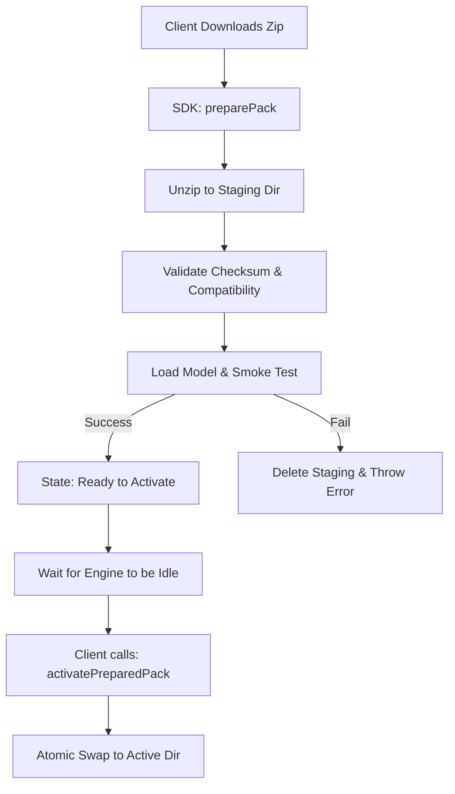

# NLU OTA Update Manager Implementation Plan

This plan outlines the architecture for the dynamic NLU model over-the-air (OTA) updates, specifically delineating the responsibilities between the `VoiceAIKit` (the core SDK/Package) and the Client Application (the Host App).

## User Review Required

> [!IMPORTANT]
> The architecture has been refined based on architectural review to prioritize **Safety, State Management, and Multi-language support**. Please review the new Storage Layout and the separated Preparation vs Activation flow.

## Open Questions

> [!WARNING]
> 1. **App Extensions:** Will the Client App need to share the downloaded models with iOS App Extensions (like Siri Intents, Widgets, or watchOS apps)? If yes, the base storage URL provided to the SDK must be an App Group container instead of the standard `Application Support` directory.
> 2. **Cryptographic Signatures:** For v1, we validate SHA-256 checksums to ensure file integrity. Do we want to require asymmetric Ed25519 signature verification immediately, or is HTTPS download + SHA256 validation sufficient for the initial launch?

## Architecture & Separation of Concerns

### 1. Client Application (Host App)
The Client App handles all networking, OS-level background scheduling, and user experience. By keeping networking in the client, we avoid duplicating network stacks and simplify iOS background download handling.

**Core Responsibilities of the Client App:**
- **Network Requests**: Call the `/api/v1/nlu/latest` endpoint using the app's existing network stack.
- **Downloading**: Execute the actual download of the `.nlu` zip file.
- **Background Execution**: Integrate with iOS `BGTaskScheduler` to silently wake the app and perform the check/download process.
- **Handoff**: Once the zip file is downloaded to a temporary URL, pass it to `VoiceAIKit` for validation and preparation.

### 2. `VoiceAIKit` (The SDK / Swift Package)
The SDK is a "Thin SDK" focused entirely on NLU logic. It does **not** make network calls. It manages the file payload, validates compatibility, runs smoke tests, and manages the active model state safely.

**Core Components to add to VoiceAIKit:**

- **`NLUPackManifest`**: A strongly typed model representing the pack metadata (version, language, minimum SDK/App versions, checksum).
- **`PackState` Enum**: Represents the explicit lifecycle: `.downloaded`, `.validating`, `.readyToActivate`, `.active`, `.failed`.
- **`NLUPackInstaller`**: The public-facing entry point.
  - `func preparePack(from packageURL: URL) async throws -> NLUPackManifest`
  - `func activatePreparedPack(version: String, language: String) async throws`
  - `func rollback(language: String) throws`
- **`PackValidator`**: Handles unzipping the `.nlu` payload, validating compatibility against minimum versions, and verifying checksums.
- **`PackStorageController`**: Manages the multi-language directory structure and atomic swapping using symbolic links or atomic renames.

---

## Safe Activation Flow

To ensure the NLU engine is never bricked by a bad update, we separate installation from activation using a staging mechanism.



### Activation Strategy & Thread Safety
While `preparePack()` can happen at any time in the background, **activation must not interrupt an active inference session**. 

**Defining "Engine Idle":** The Host Application must verify the engine is idle before calling `activatePreparedPack()`. This means:
1. No active audio recording session is capturing microphone input.
2. The `VoiceAIKit` inference queue is empty (no pending tasks).
3. We recommend adding an `isIdle` boolean property to the `VoiceAIKit` engine that the client can check.

## Package Format & Metadata

The `.nlu` file is a ZIP archive that matches the structure of the existing `VoiceIntentSeedPackEN`.

**Expected `.nlu` Package Format:**
```text
/bundle.json            # Required metadata & capabilities
/nlu_schema.json        # Intent schema definitions
/nlu_entities.json      # Entity definitions
/integrity/             # Ed25519 signatures and file checksums
/models/                # ONNX and CoreML compiled models
/lexicons/              # Language lexicons/vocabularies
/meta/                  # Additional metadata
```

**Manifest Schema (`bundle.json`):**
Instead of a simple manifest, the pack uses a robust `bundle.json` which includes cryptographic signature info, engine compatibility, and capability routing. 
```json
{
  "bundle_id": "pack-en-v1.0.36",
  "format_version": "3.0",
  "engine_compat": {
    "min_runtime_contract": 1
  },
  "checksums_root": "f60a2ee0...",
  "signature_info": {
    "scheme": "ed25519-v1",
    "key_id": "dev-key-golden"
  },
  "models": { ... }
}
```
*Note: The presence of `signature_info` and `integrity/` directory confirms we can and should implement full Ed25519 signature verification during the `preparePack` phase.*

## Rollback & Cleanup Behavior

**Rollback:** `rollback(language: "en")` restores the previously active NLU pack for the specified language whenever the Host Application determines that the newly activated pack should no longer remain active. This may include runtime initialization failures, health check failures, unexpected inference behavior, application crashes, or an explicit downgrade request. This will:
1. Identify the previous valid version in the `Packs/en/` directory.
2. Atomically update the `Current` symlink to point back to the previous version.

**Cleanup Policy:** To prevent disk bloat, cleanup is executed automatically at the end of a successful `activatePreparedPack()` call.
- The SDK deletes all folders in `Packs/{lang}/` *except*:
  1. The newly activated `Current` version.
  2. The immediately preceding version (kept as a rollback fallback).
  3. The `staging` directory is always wiped clean on startup and after any preparation.

## Proposed Storage Layout

The file system will act as the source of truth, structured to support multiple languages and versions naturally. We avoid maintaining a separate JSON registry file to prevent "out-of-sync" bugs.

```text
BaseStorageURL/ (e.g. App Support)
└── VoiceAIKit/
    └── Packs/
        ├── en/
        │   ├── 1.0.32/
        │   ├── 1.0.35/
        │   ├── Current -> 1.0.35/ (Symbolic Link)
        │   └── staging/
        └── fr/
            └── 1.0.20/
```
*(The active version is tracked exclusively via a symbolic link named `Current` pointing to the active version directory. We strictly avoid using `UserDefaults` to track state, ensuring the file system remains the single, atomic source of truth and preventing split-brain corruption).*

---

## Proposed Changes

### VoiceAIKit (SDK)

#### [NEW] `Sources/VoiceAIKit/OTA/Models/NLUPackManifest.swift`
Strongly typed Codable models for the manifest and state enums.

#### [NEW] `Sources/VoiceAIKit/OTA/NLUPackInstaller.swift`
Exposes the `preparePack` and `activatePreparedPack` APIs. Runs the inference smoke test before allowing activation.

#### [NEW] `Sources/VoiceAIKit/OTA/PackValidator.swift`
Logic to unzip, check compatibility (SDK/App versions), and verify SHA256 integrity.

#### [NEW] `Sources/VoiceAIKit/Storage/PackStorageController.swift`
Manages the `VoiceAIKit/Packs/{lang}/{version}` directory structure. Handles atomic renames from `staging` to a versioned folder and enforces the cleanup policy (e.g., keep only active and previous versions, delete the rest).

### Client Application Integration

#### [MODIFY] `Network/NLUClient.swift` (or similar App component)
Implement the network calls for `/latest` and file downloading.

#### [MODIFY] `BackgroundTasksManager.swift`
Implement the background fetch handler.
Flow: Download -> call `preparePack` -> if successful, call `activatePreparedPack`.
