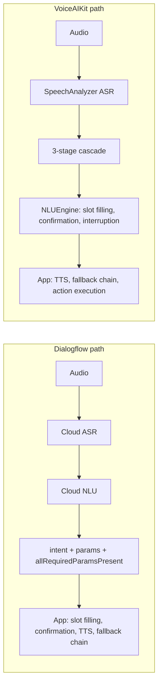

# ADR-0001 — Voice Understanding Provider abstraction for PVA

| | |
|---|---|
| **Status** | Proposed — awaiting architecture review |
| **Date** | 31 July 2026 |
| **Deciders** | Feature Architect, iOS Lead, ML Lead, Product |
| **Supersedes** | — |
| **Related** | [HLD](./HLD-voice-understanding.md) · [SPEC](./SPEC-voice-understanding-provider.md) · [PVA_Architecture_and_Decoupling.md](../PVA_Architecture_and_Decoupling.md) |

---

## 1. Context

Personal Voice Assistant sends every user utterance to Dialogflow over a gRPC audio stream and receives back a transcript and a classified intent. Three properties of that arrangement have become problems:

1. **No connectivity, no assistant.** `PersonalVoiceAssistantServiceImpl.initializeSession()` guards on `NetworkReachabilityProtocol` and refuses to start when offline. For a hearing-aid companion, the primary interaction fails exactly where users often need it.
2. **Cost scales with adoption.** Dialogflow is billed per classification, currently ~$3,099/month and rising with usage, for a workload that is overwhelmingly a fixed set of ~60 known commands.
3. **The provider is welded into the domain.** `PvaProxyService.swift` defines `DialogFlowQueryResult` / `DialogFlowIntent` typealiases bound to generated protobuf types, and those types are consumed directly by `IntentManagerProtocol`, `IntentHandlerProtocol`, and every concrete handler. Substituting a provider today means touching every intent path in the module.

Separately, we have built and validated **VoiceAIKit** — a Swift package containing an on-device pipeline (`SpeechAnalyzer` ASR → three-stage intent cascade → multi-turn dialogue engine) measured at 89.4% holdout accuracy across all 59 intents, with single-digit-millisecond classification. It is production-quality but has never been integrated into the Engage app.

We need an architecture that lets us run PVA on either provider, choose between them remotely, and roll back instantly.

## 2. Decision

**We introduce `VoiceUnderstandingProvider`, a provider-neutral protocol that spans transcription *and* dialogue, and make `PersonalVoiceAssistantServiceImpl` depend on it exclusively.**

Two adapters implement it:

- `DialogflowVoiceUnderstandingAdapter` — wraps the existing `PvaProxyServiceImpl` unchanged, translating gRPC replies and errors into neutral events.
- `OnDeviceVoiceUnderstandingAdapter` — wraps `VoiceAIKit.VoiceIntentSession`, translating `VoiceIntentEvent` into the same neutral events.

The composition root (`AppDependencyContainer`) selects one at launch from remote configuration and injects it. No other code in PVA is aware that more than one provider exists.

## 3. The decision that shapes everything else

The obvious contract — the one in the current draft design — is a **classification** contract: audio in, `IntentClassificationResult` out. It is the wrong altitude, and understanding why is the core of this ADR.

Dialogflow and VoiceAIKit do not divide the problem at the same place:



Dialogflow returns a *classification*; VoiceAIKit returns a *conversational move*. A contract shaped like the former forces us either to discard VoiceAIKit's dialogue engine, or to smuggle dialogue state through a contract that has no vocabulary for it. Both are bad.

So the contract is defined at the **dialogue-outcome** altitude: every provider emits `needsSlot`, `needsConfirmation`, `resolved`, `unresolved`, or `abandoned`. The Dialogflow adapter synthesises `needsSlot` from `allRequiredParamsPresent == false` — which is exactly what `RequiredParamsIntentHandler` infers today, just moved behind the boundary where it belongs.

**Consequence:** `RequiredParamsIntentHandler` is absorbed by the adapter layer and deleted from the handler chain. That is a deliberate simplification, not an accident.

## 4. Decisions and rationale

### D1 — The app owns the microphone

*Decision:* PVA keeps `PVARecorderFactory` → `MicrophoneSelector` → `MicrophoneRouter` → `PVAAidRecorder` / `PVAPhoneRecorder`. Providers never touch `AVAudioEngine`.

*Rationale:* hearing-aid microphone capture, proximity/charger-aware routing, and tap-detection are the product. VoiceAIKit's `VoiceIntentSession` currently constructs its own `TranscriptionCoordinator` and captures from the phone microphone — adopting that as-is would silently downgrade on-device sessions to phone-mic input. Microphone routing is also where the hardest field bugs live; forking it per provider would double that surface.

*Cost:* requires a change to VoiceAIKit — see §6.

### D2 — The provider owns speech recognition

*Decision:* ASR is inside the provider. Dialogflow transcribes in the cloud; VoiceAIKit transcribes with `SpeechAnalyzer`.

*Rationale:* the alternative — app-side ASR feeding text to both providers — would mean sending on-device transcripts to Dialogflow for classification, changing the cloud path's accuracy characteristics and its billing shape, and inventing a third integration nobody asked for. Keeping ASR inside the provider means each provider is a complete, independently testable unit.

### D3 — The provider owns multi-turn dialogue, within a carve-out matrix

*Decision:* on the on-device path, `NLUEngine` performs slot filling, confirmation and topic-interruption. On the cloud path, the adapter derives the same moves from Dialogflow's `allRequiredParamsPresent`. Three concerns are carved out and remain app-owned in **both** providers: text-to-speech (D4), the non-device fallback chain (D5), and Push-to-Talk (D6).

*Rationale, including the argument against:* the reflexive architectural instinct is to keep dialogue app-side so that a config flag changes only the classifier and never the product. That instinct is correct in general and wrong here, for one concrete reason: **VoiceAIKit's `ConversationEngine.assessSlotAnswer` feeds back into the ASR silence window.** The engine tells the endpointer whether the current partial transcript is a finished answer, and the endpointer widens or narrows its confirmation window accordingly, so a thinking pause mid-answer ("tomorrow… …at five") does not split one answer into two turns. Dialogue state and endpointing are the same concern on-device. There is no equivalent coupling on the cloud path because Dialogflow endpoints server-side. Moving dialogue app-side would discard this capability permanently and cannot be compensated for elsewhere.

*Accepted consequence:* the two providers will not be byte-identical conversational experiences. We bound this deliberately — see §5 and the [Test Strategy](./PLAN-test-strategy.md) §4, which defines a Behavioural Equivalence Suite specifying exactly where divergence is permitted and where it is a defect.

### D4 — Text-to-speech is always the app's

*Decision:* providers emit prompt and fulfilment **text**. They never speak. `VoiceIntentSession` is configured with `speaksPrompts: false`.

*Rationale:* `VoiceIntentSession` owns an `AVSpeechSynthesizer` via `ConversationSpeaker`, and PVA owns one via `SpeechSynthesizing`. Two synthesizers contending for an audio route that is a *hearing aid* is a defect class we should not create. The app also serialises TTS against recorder state and Push-to-Talk playback; that serialisation exists only app-side.

*Consequence:* the kit's internal mic-suppression-during-TTS logic becomes the app's responsibility on the on-device path. The SPEC requires providers to expose `suspendCapture()` / `resumeCapture()` so the app can drive it explicitly.

### D5 — The non-device fallback chain is always the app's

*Decision:* when a provider cannot resolve an utterance it emits `unresolved(reason:)` carrying the query text. It does not terminate the turn, and it does not hand off.

*Rationale:* PVA's out-of-scope path is a chain — CMS tagged content → GenAI with chat history → Wolfram Alpha for real-time facts, with a GenAI formatting step — implemented in `PersonalVoiceAssistantServiceImpl`. VoiceAIKit's `NLUResponse.fallback(url:)` hands off to a single GenAI URL, which is correct for the standalone STT demo app and wrong for Engage. The adapter **MUST** discard `fallbackURL` and map to `unresolved`.

*Consequence:* this is the highest-risk mapping in the whole integration and the easiest to get silently wrong. It gets its own conformance test.

### D6 — Push-to-Talk dialogue is always the app's

*Decision:* the `Cmd.SendMessage` / `yes` / `no` / `Cmd.ListenMessage` family is declared in `ProviderCapabilities.appOwnedIntentFamilies`. Providers **MUST** return these as terminal `resolved` outcomes and **MUST NOT** open a slot-filling or confirmation flow for them.

*Rationale:* `PushToTalkIntentHandler` drives a state machine with message-recording timers, contact resolution, confirmation, and cancel semantics — and the existing design note is explicit that its timeout behaviour must be preserved exactly to avoid UX regressions. VoiceAIKit has no knowledge of it. Reimplementing it inside the kit would duplicate the riskiest state machine in the module; letting it straddle both would be worse than either.

*Consequence:* the yes/no confirmation vocabulary is shared between the kit's `confirm` flow and P2T's confirmation state. The adapter must route yes/no to whichever owns the active turn. This is specified in [SPEC §6.3](./SPEC-voice-understanding-provider.md).

### D7 — Provider selection resolves once, at app launch

*Decision:* `AppDependencyContainer` reads remote config during composition and constructs exactly one provider. The choice is immutable for the process lifetime. There is no mid-session switching and no per-utterance routing.

*Rationale:* determinism during incident analysis. A support ticket must be attributable to one provider without reconstructing a timeline of config fetches. It also keeps the state machine honest — a provider holds ASR state, dialogue state and a network channel; swapping it mid-session is a correctness problem nobody needs.

*Consequence:* a kill-switch takes effect on next launch, not immediately. Mitigated in [Migration & Rollout](./PLAN-migration-and-rollout.md) §6 by staged cohort rollout, which limits exposure without needing instant revocation.

*Explicitly deferred:* shadow mode — running the on-device classifier silently alongside Dialogflow and logging disagreement. It is the single best de-risking instrument available to us, and it is deferred only because it requires a telemetry contract and a privacy review (Q4) that would otherwise gate the whole programme. Revisit at Phase 4.

## 5. Consequences

**Positive**

- PVA business logic, all ten intent handlers, and the P2T state machine become provider-agnostic. Adding a third provider later is an adapter, not a refactor.
- The offline gap closes for the ~60 known commands on the on-device path.
- Dialogflow spend becomes a function of cohort size, controlled by config.
- Protobuf types are confined to one file. Today they leak into the domain.
- `RequiredParamsIntentHandler` is absorbed into the adapter layer, shortening the handler chain.

**Negative / accepted risks**

- **VoiceAIKit must change** to accept injected audio (§6). It is currently a closed mic-to-intent appliance. This is real package work, not configuration.
- **Two dialogue implementations exist behind one flag.** Bounded, not eliminated, by the Behavioural Equivalence Suite. This is the cost of D3 and we are taking it knowingly.
- **On-device confidence is not comparable to Dialogflow confidence.** The kit exposes calibrated per-stage scores; Dialogflow exposes its own. Any logic that compares confidence across providers is invalid. The SPEC marks confidence as diagnostic-only.
- **Language coverage differs.** VoiceAIKit ships en/fr/de/da; Dialogflow's coverage is broader. Config must not enable on-device for a locale without a language pack — enforced by `ProviderCapabilities.supportedLanguages`.
- **Memory.** Stage 3 (MiniLM) adds ~100 MB `phys_footprint`, of which ~65 MB is a persistent floor. Engage is a larger app than the STT demo; this needs a measured budget decision before Phase 4.
- **Migration is not free.** Every handler signature changes. Sequenced to be mechanical and independently testable — see the Migration plan.

## 6. Required change to VoiceAIKit

This is the one external dependency of the whole design and should be scheduled first.

`VoiceIntentSession` constructs `TranscriptionCoordinator()` internally and therefore always captures from the phone microphone. `TranscriptionCoordinator` already accepts an injected `captureServiceFactory: () -> any AudioInputProvider`, and `AudioInputProvider` is public — so the seam exists one layer down; only the facade hides it.

**Change required:**

```swift
public enum VoiceAudioSource: Sendable {
    /// Today's behaviour: the session captures from the device microphone.
    case managedMicrophone
    /// The host application captures audio and pushes buffers in.
    case injected(any AudioInputProvider)
}

public struct VoiceIntentConfiguration: Sendable {
    public var audioSource: VoiceAudioSource = .managedMicrophone   // NEW — default preserves current behaviour
    // ... existing fields unchanged
}
```

plus a small `PushAudioInputProvider` in the kit (an `AudioInputProvider` backed by an `AsyncStream` continuation the host writes into), and `suspendCapture()` / `resumeCapture()` on the session for D4.

This is additive and default-preserving: the STT demo app and existing tests are unaffected. Estimated at 2–3 days including tests. **Do not begin Phase 2 of the migration until this has landed and shipped a tagged package version.**

## 7. Alternatives considered

| Alternative | Why rejected |
|---|---|
| **Classification-altitude contract** (`IntentClassificationService` returning `IntentClassificationResult`, per the current draft) | Cannot express the dialogue moves VoiceAIKit produces. Would force us to discard `NLUEngine` and its endpointing arbiter, or to encode dialogue state in a contract with no vocabulary for it. §3. |
| **Let VoiceAIKit own the microphone in on-device mode** | Loses hearing-aid mic capture and all proximity/connectivity routing on the on-device path. Product non-starter. D1. |
| **App owns ASR; both providers receive text** | Discards `assessSlotAnswer` endpointing; changes Dialogflow's accuracy and billing profile; invents a third integration shape. D2. |
| **Move all dialogue app-side for both providers** | Architecturally cleaner and genuinely tempting, but permanently forfeits content-aware endpointing. Retained as a possible Phase 6 if the equivalence suite shows divergence is unmanageable. D3. |
| **Per-utterance provider routing** (cheap commands on-device, hard ones to cloud) | Attractive on paper. In practice the decision must be made *before* ASR, when nothing is known about the utterance. Post-hoc escalation already exists as the `unresolved` → GenAI chain. D7. |
| **Replace Dialogflow outright, no abstraction** | No rollback path, no cohort control, and one bad model version becomes an app-store-cycle incident on a medical-adjacent product. Non-starter. |
| **Fork PVA into two parallel implementations behind a flag** | Fastest to a demo, unmaintainable within two releases, doubles every regression. Explicitly rejected. |

## 8. Compliance and traceability notes

Engage is adjacent to a regulated device category. Two properties must survive this change and are called out so they are not lost in implementation:

1. **Attributability.** For any given session it must be answerable, from telemetry alone, which provider ran and — for on-device — which model bundle version and checksum. Carried by `ProviderCapabilities.providerIdentity` in the SPEC.
2. **Determinism of the on-device path.** The same input must produce the same output for a fixed model version. Guaranteed today by checksummed, versioned artifacts. Any future move to an OS-provided model (`NLContextualEmbedding`, Foundation Models) weakens this and is out of scope here — see [APPLE_PLATFORM_OPTIONS_2026.md](../APPLE_PLATFORM_OPTIONS_2026.md).
