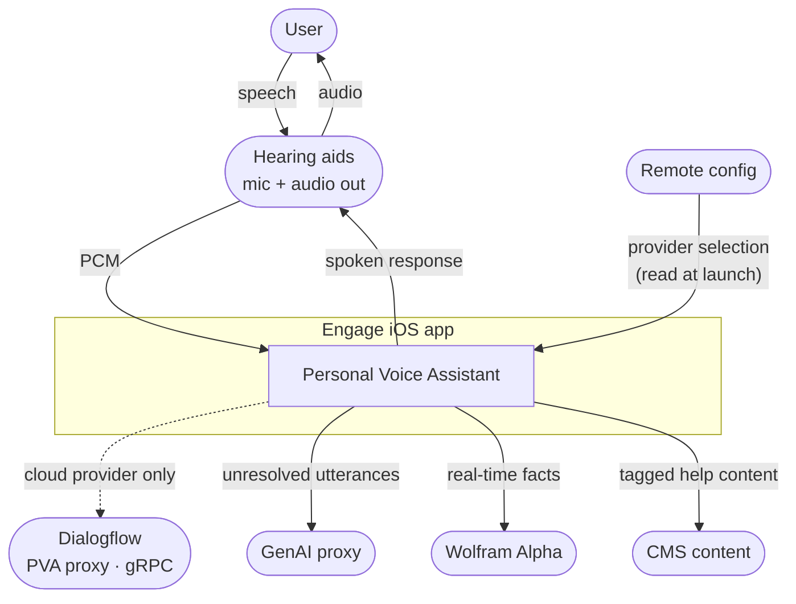
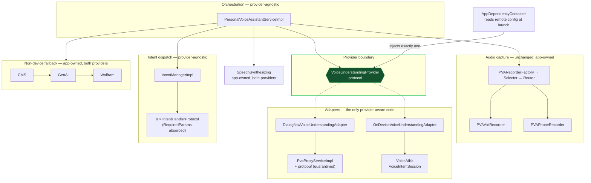
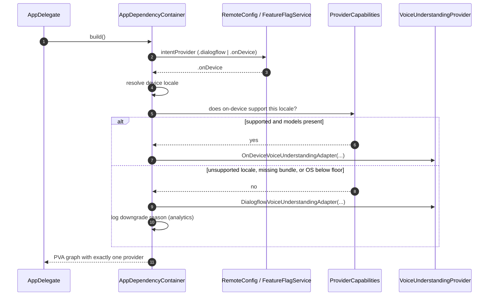
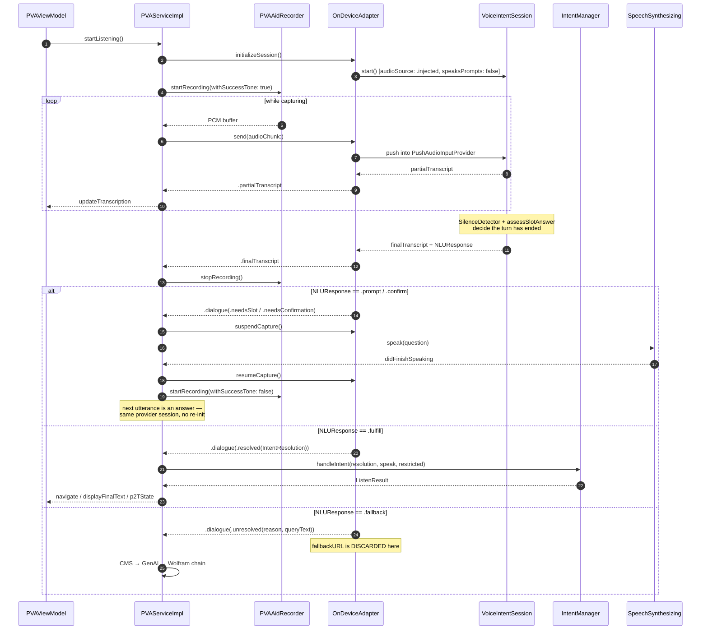
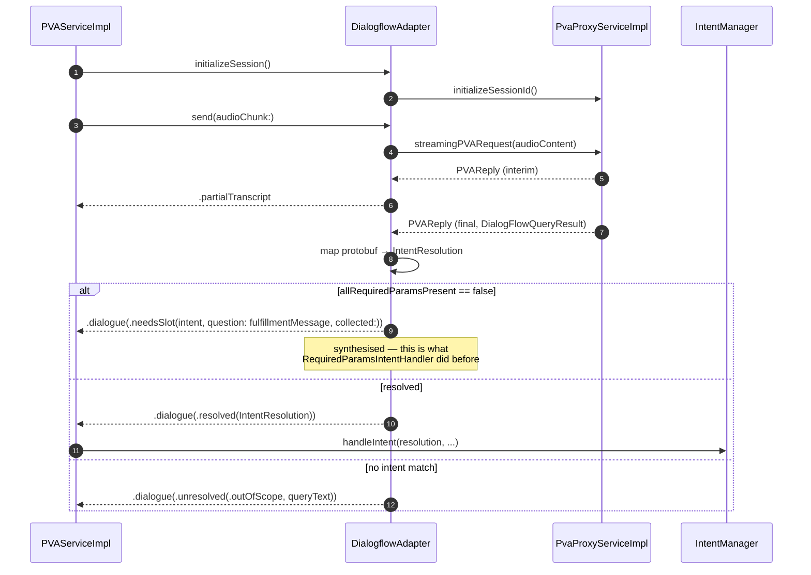
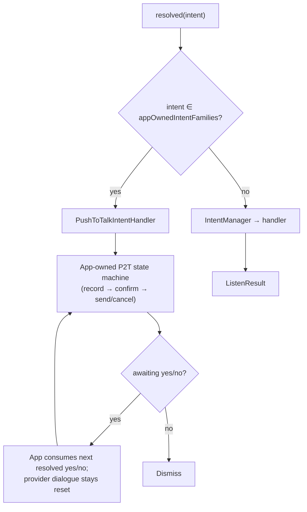
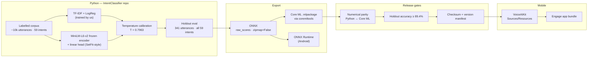

# HLD — PVA Voice Understanding

**Status:** Draft for review · **Date:** 31 July 2026 · **Owner:** Feature Architect
**Normative contract:** [SPEC-voice-understanding-provider.md](./SPEC-voice-understanding-provider.md) · **Decision record:** [ADR-0001](./ADR-0001-voice-understanding-provider-abstraction.md)

---

## 1. Scope

| In scope | Out of scope |
|---|---|
| PVA module: `Engage/Engage/Services/PersonalVoiceAssistant` | Dialogflow agent content and training |
| Composition root: `Containers/AppDependencyContainer.swift` | GenAI / Wolfram / CMS service internals |
| VoiceAIKit package integration and the facade change it requires | Android integration (parallel effort, same contract) |
| Model supply chain from Python training to device bundle (§8) | Hearing-aid firmware and BLE transport |
| Remote-config-driven provider selection | New intents or new product capability |

## 2. System context



The change in this document affects exactly one edge: the dotted one. Everything else is unchanged.

## 3. Current state and where the coupling lives

### 3.1 Component view

```mermaid
flowchart TB
  subgraph UI["Presentation"]
    V["PersonalVoiceAssistantView"] --> VM["PersonalVoiceAssistantViewModel"]
    HLP["PVAHelper"]
  end

  subgraph ORCH["Orchestration"]
    S["PersonalVoiceAssistantServiceImpl"]
  end

  subgraph AUDIO["Audio capture"]
    RF["PVARecorderFactory"] --> SEL["MicrophoneSelectorImpl"] --> RT["MicrophoneRouterImpl"]
    RF --> AID["PVAAidRecorder"]
    RF --> PH["PVAPhoneRecorder"]
    ADW["AudioDataWriterService"]
  end

  subgraph NLU["Classification — COUPLED"]
    PX["PvaProxyServiceImpl<br/>gRPC streaming"]
    PB["DialogFlowQueryResult<br/>DialogFlowIntent · PVAReply<br/>(generated protobuf)"]
    PX --- PB
  end

  subgraph DISPATCH["Intent dispatch"]
    IM["IntentManagerImpl"]
    H["10 × IntentHandlerProtocol"]
    IM --> H
  end

  subgraph FB["Non-device fallback"]
    C1["CMSContentService"] --> C2["GenAIProxyService"] --> C3["WolframAlphaService"]
  end

  VM --> S
  HLP --> S
  S --> RF
  S --> PX
  S --> IM
  S --> FB
  S --> ADW

  PB -. "protobuf types leak<br/>across the boundary" .-> IM
  PB -. .-> H
  PB -. .-> S

  style PB fill:#7f1d1d,stroke:#ef4444,color:#fff
  style NLU stroke:#ef4444,stroke-width:2px
```

### 3.2 The five coupling points

| # | Where | What leaks | Blast radius if provider changes |
|---|---|---|---|
| C1 | `PvaProxyService.swift` | `typealias DialogFlowQueryResult` / `DialogFlowIntent` / `PVAReply` bound to generated gRPC messages | The type vocabulary of the entire module |
| C2 | `IntentHandlerProtocol` | `handleIntent(queryResult: DialogFlowQueryResult, …)` | All 10 handlers |
| C3 | `IntentManagerProtocol` / `IntentManagerImpl` | Passes the protobuf through the dispatch loop | Dispatch layer |
| C4 | `PersonalVoiceAssistantServiceImpl` | Reads `queryResult.intent.displayName`, `.fulfillmentMessage`, `.parameters`, `.allRequiredParamsPresent` | Orchestration, fallback routing, analytics |
| C5 | Error and timeout semantics | `PvaProxyServiceError` values are Dialogflow-transport-shaped | Timeout UX, retry policy, `listenTimedOut` |

C4 is the subtle one. `allRequiredParamsPresent` is not a transport detail — it is a *dialogue* signal that PVA reads directly and converts into `notEnoughInfo` via `RequiredParamsIntentHandler`. That is the seam the target architecture formalises.

## 4. Target state



**Invariant:** protobuf types exist only inside `DialogflowVoiceUnderstandingAdapter` and below. `VoiceAIKit` types exist only inside `OnDeviceVoiceUnderstandingAdapter` and below. Neither appears anywhere else in the app. This is enforceable by a lint/CI grep — see [Test Strategy](./PLAN-test-strategy.md) §7.

## 5. Responsibility allocation

### 5.1 Layer responsibilities after the change

| Component | Owns | Must not |
|---|---|---|
| `PersonalVoiceAssistantServiceImpl` | Session lifecycle, recorder selection, audio pumping, turn arbitration, fallback chain, TTS, analytics | Know which provider is active; parse provider-native types |
| `VoiceUnderstandingProvider` (protocol) | The neutral vocabulary of a voice turn | — |
| `DialogflowVoiceUnderstandingAdapter` | gRPC stream lifecycle, protobuf → neutral mapping, synthesising dialogue moves from `allRequiredParamsPresent` | Execute actions; speak; call GenAI |
| `OnDeviceVoiceUnderstandingAdapter` | `VoiceIntentSession` lifecycle, audio injection, `VoiceIntentEvent` → neutral mapping, discarding `fallbackURL` | Execute actions; speak; call GenAI |
| `IntentManagerImpl` + handlers | Mapping a resolved intent to an in-app action | Know the provider; perform dialogue |
| `PVARecorderFactory` and recorders | Microphone selection, capture, tones, stop/start | Know the provider |

### 5.2 Dialogue ownership matrix — the load-bearing table

This table is the operational form of ADR decisions D3–D6. **If you read one thing in this document, read this.**

| Concern | Cloud provider | On-device provider | Rationale |
|---|---|---|---|
| Speech recognition | Provider (Dialogflow cloud ASR) | Provider (`SpeechAnalyzer`) | ADR D2 |
| Endpointing / turn end | Provider (server-side VAD) | Provider (`SilenceDetector` + `assessSlotAnswer`) | Coupled to dialogue state on-device — ADR D3 |
| Intent classification | Provider | Provider (3-stage cascade) | — |
| Entity / slot extraction | Provider | Provider (`EntityExtractor`) | — |
| **Slot filling (re-prompt for missing params)** | **Adapter** (synthesised from `allRequiredParamsPresent`) | **Provider** (`NLUEngine`) | ADR D3 |
| **Confirmation (yes/no gate)** | **Adapter** | **Provider** (`NLUEngine`) | ADR D3 |
| **Topic interruption mid-slot-fill** | Not supported (emit `abandoned` on new intent) | **Provider** (`NLUResponse.interrupted`) | Permitted divergence — Test Strategy §4 |
| **Text-to-speech** | **App** | **App** (`speaksPrompts: false`) | ADR D4 |
| **Non-device fallback chain (CMS → GenAI → Wolfram)** | **App** | **App** (adapter discards `fallbackURL`) | ADR D5 |
| **Push-to-Talk state machine** | **App** | **App** (declared app-owned family) | ADR D6 |
| Action execution | **App** (handlers) | **App** (handlers) | — |
| Analytics and attribution | **App** | **App** | ADR §8 |

Rows in bold are where a naive integration goes wrong. Each has a dedicated conformance test.

## 6. Runtime flows

### 6.1 Composition at launch



The capability gate is not optional. A remote flag that enables on-device for a locale with no language pack must degrade to Dialogflow, not fail — and must say so in telemetry, or the rollout is unmeasurable.

### 6.2 A turn on the on-device provider



### 6.3 The same turn on the cloud provider



Note the symmetry: `PersonalVoiceAssistantServiceImpl` runs identical code in 6.2 and 6.3. That symmetry is the deliverable.

### 6.4 Push-to-Talk carve-out



The rule the adapter must enforce: **while a P2T turn is active, the provider's own dialogue state is held reset** (`resetDialogue()` after each P2T-family resolution), so a yes/no cannot be captured by the kit's confirmation flow instead of P2T's.

## 7. Non-functional requirements

| Attribute | Requirement | How met | How verified |
|---|---|---|---|
| Offline capability | On-device provider completes a full command turn with no network | `SpeechAnalyzer` + bundled models; recorder is local | Airplane-mode device suite |
| Latency (classification) | p95 ≤ 50 ms from final transcript to dialogue outcome, on-device | 3-stage cascade measured at 1–10 ms | Instrumented adapter timing |
| Latency (perceived) | No regression vs. Dialogflow p95 | Endpointing dominates; unchanged app-side | Field telemetry, A/B cohort |
| Memory | Documented budget; Stage 3 adds ~100 MB `phys_footprint`, ~65 MB persistent | Config `loadsSemanticRescue` allows opt-out | `MemoryProbe`, device profiling |
| Accuracy | On-device ≥ 89.4% on the 59-intent holdout, per shipped model version | Versioned, checksummed artifacts | Parity + holdout CI gate |
| Attributability | Provider identity + model version + checksum recoverable per session | `ProviderCapabilities.providerIdentity` | Analytics schema review |
| Determinism | Same input → same output for a fixed model version | Frozen artifacts, no OS-model dependency | `IntentClassifierCoreMLParityTests` |
| Rollback | Return an affected cohort to Dialogflow without an app release | Remote config, launch-scoped | Rollout rehearsal (Phase 5) |
| Privacy | On-device path transmits no audio or transcript for in-scope commands | Architecture; verified by network capture | Charles/proxy test in QA suite |

## 8. Model supply chain — Python to device

The provider abstraction is only half the architecture. The other half is how a trained model becomes a bundle a device can trust. Documented here because it is the part reviewers most often find missing.



**Artifacts crossing the boundary and their contracts**

| Artifact | Contract | Consumer |
|---|---|---|
| `IntentClassifier.mlpackage` | Input `"input"` (String), output `"classProbability"` (Dictionary<String, Double>) — TF-IDF baked into the graph | `IntentClassifierService` Stage 2 |
| `MiniLMEmbedder.mlpackage` | `input_ids` / `attention_mask` / `token_type_ids` → token embeddings, mean-pooled, L2-normalised, 384-dim | `SemanticEmbedder` Stage 3 |
| `semantic_head.json` | `{labels, weights[N×384], bias[N]}` | `SemanticClassifier` Stage 3 |
| `minilm-vocab.txt` | BERT WordPiece vocab; **must** match the Python tokenizer exactly | `SemanticEmbedder` |
| `nlu_schema.json` + language packs | Intent catalogue, keyword rules, slot definitions, prompts | `KeywordMatcher`, `NLUEngine` |
| `intent_classifier_weights.json` | Thresholds (`conf_threshold` 0.70, `conf_gap_threshold` 0.20) + JSON-weights fallback path | `IntentClassifierService` |

**Versioning rule.** A model bundle version is a single opaque string (e.g. `pack-en-v1.0.26`) covering *all* artifacts above plus the thresholds. Artifacts are never mixed across versions. The version and a checksum are logged with every session — this is what makes ADR §8 attributability real rather than aspirational.

**The parity gate is the contract.** `IntentClassifierCoreMLParityTests` + `coreml_golden_fixtures.json` assert that Swift and Python produce identical outputs for a fixed input set. This is the only thing standing between a training-pipeline change and a silent behavioural regression on device. It runs today in `.github/workflows/ios-coreml-parity.yml` and **must** become a merge gate on the model repo, not just the app repo.

## 9. Configuration surface

| Key | Type | Default | Effect |
|---|---|---|---|
| `pva.intentProvider` | enum `dialogflow` \| `onDevice` | `dialogflow` | Provider selected at launch |
| `pva.onDevice.enabledLocales` | `[String]` | `["en"]` | Gate; unmatched locale downgrades to cloud |
| `pva.onDevice.loadSemanticRescue` | Bool | `true` | Stage 3 on/off — the memory lever |
| `pva.onDevice.minimumOSVersion` | String | `"26.0"` | `SpeechAnalyzer` floor |

Selection is read once, in `AppDependencyContainer`. Nothing downstream re-reads it. A change takes effect at next launch (ADR D7).

## 10. Risks

| Risk | L | I | Mitigation |
|---|---|---|---|
| VoiceAIKit facade change slips | M | H | Schedule first, before any app-side phase; it is the critical path (ADR §6) |
| Dialogue divergence between providers surfaces as user-visible inconsistency | M | M | Behavioural Equivalence Suite defines permitted divergence explicitly |
| `fallbackURL` mistakenly treated as terminal, bypassing CMS/GenAI/Wolfram | M | **H** | Dedicated conformance test; adapter is forbidden from importing URL-opening APIs |
| Yes/no captured by kit confirmation instead of P2T | M | **H** | `resetDialogue()` after every app-owned-family resolution; P2T regression suite |
| Stage 3 memory pushes Engage over budget on older devices | M | H | Measure early (Phase 2); `loadSemanticRescue` is a remote lever |
| Handler signature migration breaks an untested intent path | M | H | Mechanical, one handler per PR, each with tests before merge |
| Hearing-aid PCM format incompatible with `SpeechAnalyzer` input | L | H | Resolve Q1 in Phase 0; `BufferConverter` already exists in the kit |
| On-device enabled for a locale with no language pack | M | M | Capability gate + downgrade telemetry (§6.1) |
