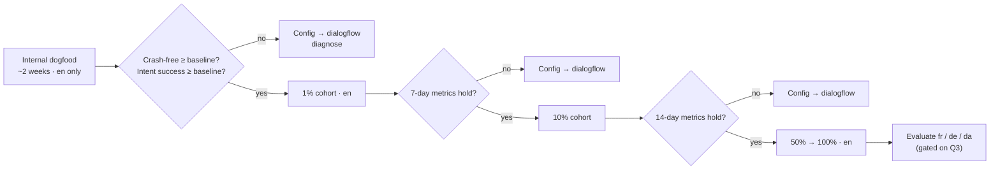

# PLAN — Migration & Rollout

**Status:** Draft · **Date:** 31 July 2026 · **Owner:** Feature Architect
**Context:** [ADR-0001](./ADR-0001-voice-understanding-provider-abstraction.md) · [HLD](./HLD-voice-understanding.md) · [SPEC](./SPEC-voice-understanding-provider.md)

---

## 1. Principles

Four rules govern sequencing. Everything below follows from them.

1. **Behaviour changes in exactly one phase.** Phases 0–3 are refactors with zero intended behavioural change; Phase 4 is the only one where a user could notice anything. If a Phase 0–3 change alters behaviour, that is a defect, and the equivalence suite should catch it.
2. **Dialogflow stays the default until the last possible moment.** The on-device provider is dark-shipped, then cohort-enabled.
3. **Every phase is independently releasable.** No phase leaves `main` in a state that cannot ship. Long-lived integration branches are prohibited.
4. **The package change lands first.** Phase 2 cannot start until VoiceAIKit accepts injected audio (ADR §6). It is the critical path and the only work with an external dependency.

## 2. Phase overview

```mermaid
gantt
    title Migration sequence (relative weeks, not committed dates)
    dateFormat X
    axisFormat W%s

    section Package
    P0 · VoiceAIKit audio injection      :p0, 0, 3
    section App refactor (no behaviour change)
    P1 · Neutral contract + Dialogflow adapter :p1, 1, 3
    P2 · Orchestration migration              :p2, after p1, 2
    P3 · Handler contract migration           :p3, after p2, 3
    section New capability
    P4 · On-device adapter + capability gate   :p4, after p0, 3
    section Release
    P5 · Cohort rollout + rehearsal            :p5, after p3, 4
```



P0 and P1 run in parallel — different codebases, different people.

---

## 3. Phase 0 — VoiceAIKit accepts injected audio

**Repository:** VoiceAIKit · **Behaviour change:** none (default-preserving) · **Est.** 2–3 days

| # | Change | Notes |
|---|---|---|
| 0.1 | Add `VoiceAudioSource` enum and `VoiceIntentConfiguration.audioSource`, defaulting to `.managedMicrophone` | Existing callers unaffected |
| 0.2 | Add `PushAudioInputProvider: AudioInputProvider` backed by an `AsyncStream` continuation | The kit already has `BufferConverter` for format adaptation |
| 0.3 | Thread `audioSource` through `VoiceIntentSession` → `TranscriptionCoordinator(captureServiceFactory:)` | The seam already exists; only the facade hides it |
| 0.4 | Add `suspendCapture()` / `resumeCapture()` to `VoiceIntentSession` | Required for host-driven TTS serialisation (SPEC §6.2) |
| 0.5 | Tests: injected-audio smoke test using `FileCaptureService` as the source; assert identical intents vs. the managed-mic path | |
| 0.6 | Tag a package version; publish release notes | Consumed by Phase 4 |

**Exit criteria:** existing STT demo app builds and behaves identically; a new test drives a full turn from injected buffers; version tagged.

**Answers open question Q1** — establish the exact PCM format `PVAAidRecorder` emits and confirm `BufferConverter` handles it.

---

## 4. Phase 1 — Neutral contract and Dialogflow adapter

**Repository:** Engage · **Behaviour change:** none · **Est.** 1–1.5 weeks

Nothing consumes the new types yet. This phase exists so the contract can be reviewed and tested in isolation before anything depends on it.

**New files**

```
Services/PersonalVoiceAssistant/VoiceUnderstanding/
├── VoiceUnderstandingProvider.swift          — protocol (SPEC §2.1)
├── VoiceUnderstandingEvents.swift            — events + DialogueOutcome (SPEC §2.2–2.3)
├── IntentResolution.swift                    — payload + ParameterValue (SPEC §2.4)
├── ProviderCapabilities.swift                — capabilities + identity (SPEC §2.5)
├── ProviderFailure.swift                     — error taxonomy (SPEC §7)
└── Adapters/
    └── DialogflowVoiceUnderstandingAdapter.swift
```

**Rules for this phase**

- `PvaProxyServiceImpl` is **not modified**. The adapter wraps it.
- No existing file is edited except the container, and only to register the adapter (unused).
- Parameter mapping must be **total**. Enumerate the actual Dialogflow `Struct` inhabitants in use (open question Q2) and map each to a `ParameterValue` case; log every `.unmodelled`.

**Exit criteria:** adapter unit tests green against recorded Dialogflow replies (golden fixtures); `RequiredParamsIntentHandler`'s logic reproduced in the adapter's `.needsSlot` synthesis and proven equivalent by test; conformance checklist (SPEC §10) passes for this adapter.

---

## 5. Phase 2 — Orchestration migration

**Repository:** Engage · **Behaviour change:** none intended · **Est.** 1 week
**This is the highest-risk phase.** It rewires the live path.

| # | Change |
|---|---|
| 2.1 | `PersonalVoiceAssistantServiceImpl` takes `VoiceUnderstandingProvider` instead of `PvaProxyService` |
| 2.2 | Replace `subscribeToDialogFlowResponse()` with `subscribeToVoiceUnderstandingEvents()` |
| 2.3 | Route captured PCM through `provider.audioFormat` conversion → `send(audioChunk:)` |
| 2.4 | Implement host obligations (SPEC §4): TTS on prompts, `startTurn()` after speaking, fallback chain on `.unresolved`, `resetDialogue()` before app-owned families |
| 2.5 | Preserve timeout durations, retry policy and analytics events **byte-for-byte** |
| 2.6 | `AppDependencyContainer` composes the Dialogflow adapter as the only provider |

At the end of this phase, handlers still consume `DialogFlowQueryResult` — the adapter converts back at the dispatch boundary as a temporary shim. **The shim must be deleted in Phase 3**; track it as an explicit task, not a TODO comment.

**Exit criteria:** full PVA regression suite green; timeout and error UX manually verified against a pre-change build; no protobuf reference remains in `PersonalVoiceAssistantServiceImpl`.

---

## 6. Phase 3 — Handler contract migration

**Repository:** Engage · **Behaviour change:** none · **Est.** 1.5 weeks

Mechanical and highly parallelisable. **One handler per pull request.**

| # | Change |
|---|---|
| 3.1 | `IntentHandlerProtocol.handleIntent` takes `IntentResolution` |
| 3.2 | `IntentManagerProtocol` / `IntentManagerImpl` updated to match |
| 3.3 | Migrate the nine handlers, one PR each, tests before merge |
| 3.4 | **Delete `RequiredParamsIntentHandler`** — absorbed by the adapter in Phase 1 |
| 3.5 | Delete the Phase 2 back-conversion shim |
| 3.6 | Add the CI lint: no protobuf or VoiceAIKit symbol outside `Adapters/` |

Migration order — least to most coupled, so the pattern is established on easy cases first:

`BatteryStatusIntentHandler` → `ActivityStepsIntentHandler` → `FindMyPhoneIntentHandler` → `VolumeIntentHandler` → `StartStopStreamIntentHandler` → `MemoryChangeIntentHandler` → `ReminderCompleteIntentHandler` → `ReminderIntentHandler` → `PushToTalkIntentHandler`

`PushToTalkIntentHandler` is last, deliberately: it is the riskiest and benefits most from a settled pattern.

**Exit criteria:** zero protobuf references outside `DialogflowVoiceUnderstandingAdapter.swift`, enforced by CI; full suite green; P2T regression suite green.

---

## 7. Phase 4 — On-device provider

**Repository:** Engage (depends on Phase 0 tag) · **Behaviour change:** dark — new code, disabled by config · **Est.** 1.5 weeks

| # | Change |
|---|---|
| 4.1 | Add VoiceAIKit as a package dependency at the tagged version |
| 4.2 | Implement `OnDeviceVoiceUnderstandingAdapter` per SPEC §6.2 |
| 4.3 | Implement the capability gate in `AppDependencyContainer` (HLD §6.1), including downgrade telemetry |
| 4.4 | Wire config keys (HLD §9); default `pva.intentProvider = dialogflow` |
| 4.5 | Measure `phys_footprint` with and without Stage 3 on the oldest supported device; record in the HLD NFR table |
| 4.6 | Run the Behavioural Equivalence Suite across both providers |

**Exit criteria:** on-device provider passes the SPEC §10 conformance checklist and the equivalence suite; memory budget signed off; airplane-mode suite green; network capture confirms no audio or transcript leaves the device on the on-device path.

---

## 8. Phase 5 — Rollout



**Gate metrics** — each compared against the Dialogflow cohort over the same window:

| Metric | Gate |
|---|---|
| Crash-free session rate | ≥ Dialogflow cohort |
| PVA session completion rate | ≥ Dialogflow cohort − 1pp |
| Intent success rate (resolved / total turns) | ≥ Dialogflow cohort − 2pp |
| Fallback-chain entry rate | ≤ Dialogflow cohort + 3pp |
| p95 turn latency | ≤ Dialogflow cohort |
| Memory-pressure terminations | ≤ Dialogflow cohort |
| Support tickets tagged PVA | no statistically significant increase |

**Rollback.** Set `pva.intentProvider = dialogflow`. Because selection is launch-scoped (ADR D7), this takes effect on the user's next app launch — typically within hours, not instantly. Two mitigations make that acceptable: cohorts are small until confidence is high, and the on-device path degrades to the existing fallback chain rather than failing outright. **Rehearse the rollback in the dogfood phase** and record the observed time-to-effect; a rollback procedure that has never been executed is not a rollback procedure.

---

## 9. What could break, and where it will show

| Failure mode | Phase | Detection |
|---|---|---|
| Timeout semantics drift during rewiring | 2 | Timing assertions in the adapter suite; manual timeout UX check |
| A handler silently mis-reads a migrated parameter | 3 | Per-handler unit tests with golden fixtures |
| P2T yes/no captured by the provider's confirmation flow | 4 | P2T regression suite; SPEC §6.3 arbitration test |
| `fallbackURL` treated as terminal, bypassing CMS/GenAI/Wolfram | 4 | Dedicated conformance test; adapter forbidden from linking URL APIs |
| Stage 3 memory pushes Engage over budget on older devices | 4 | Device profiling in 4.5; `loadSemanticRescue` remote lever |
| On-device enabled for an unsupported locale | 4/5 | Capability gate + downgrade telemetry |
| Analytics events change shape, breaking dashboards | 2 | Event-schema snapshot test |

## 10. Estimate summary

| Phase | Effort | Can start |
|---|---|---|
| 0 — Package audio injection | 2–3 days | immediately |
| 1 — Contract + Dialogflow adapter | 1–1.5 weeks | immediately (parallel with 0) |
| 2 — Orchestration | 1 week | after 1 |
| 3 — Handlers | 1.5 weeks | after 2 |
| 4 — On-device provider | 1.5 weeks | after 0 and 3 |
| 5 — Rollout | 4+ weeks elapsed | after 4 |

**Engineering effort ≈ 5.5–6 weeks**, plus rollout elapsed time. Phases 0 and 1 in parallel put the critical path at roughly 5 weeks to a dark-shipped on-device provider.

These are engineering estimates for a two-person iOS effort with QA support. They exclude regulatory assessment (open question Q5), privacy review for telemetry (Q4), and the language-scope decision (Q3).
