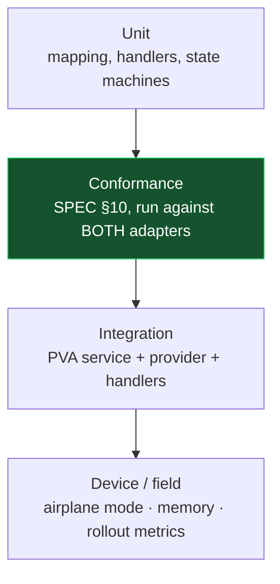

# PLAN — Test Strategy

**Status:** Draft · **Date:** 31 July 2026 · **Owner:** Feature Architect
**Context:** [SPEC](./SPEC-voice-understanding-provider.md) · [Migration & Rollout](./PLAN-migration-and-rollout.md)

---

## 1. What we are actually trying to prove

Three claims, in descending order of importance:

1. **The refactor changed nothing.** Phases 1–3 are behaviour-preserving. Any observable difference is a defect.
2. **The two providers are equivalent where they must be, and divergent only where we said they could be.** This is the claim the ADR's D3 decision makes necessary.
3. **The on-device path is correct offline, fast enough, and within memory budget.**

Everything below serves one of these three.

## 2. Test pyramid for this programme



The conformance layer is highlighted because it is the novel one and the one most likely to be skipped under schedule pressure. It is the layer that makes provider substitution safe.

## 3. Conformance suite — one suite, both adapters

A single parameterised suite runs against every conforming provider. Adding a third provider later means running this suite, not writing a new one.

```swift
protocol ProviderConformanceCase {
    static func makeProvider() -> any VoiceUnderstandingProvider
    static var fixtures: ProviderFixtures { get }   // recorded replies / audio
}

// Run for: DialogflowAdapterConformance, OnDeviceAdapterConformance
```

| # | Assertion | SPEC ref |
|---|---|---|
| CF-01 | Exactly one terminal event per turn, across resolved / unresolved / timeout / failure | §3.2.6 |
| CF-02 | `.finalTranscript` precedes `.dialogue` in every non-error turn | §3.2.3 |
| CF-03 | Events arrive in emission order on one serial scheduler | §3.2.7 |
| CF-04 | `send(audioChunk:)` outside `Capturing` is discarded without throwing | §3.2.2 |
| CF-05 | `initializeSession()` is idempotent | §3.2.1 |
| CF-06 | `closeSession()` is safe from every state and releases resources | §3.2.5 |
| CF-07 | `cancelTurn()` emits nothing further and does **not** clear dialogue state | §3.2.4 |
| CF-08 | Intents in `appOwnedIntentFamilies` always return terminal `.resolved` | §4.5 |
| CF-09 | Parameter mapping is total; `.unmodelled` is logged, never silent | §2.4 |
| CF-10 | `providerIdentity` fully populated (incl. model version/checksum on-device) | §8 |
| CF-11 | No low-confidence `.resolved` leaks; thresholding is internal | §5 |
| CF-12 | **On-device only:** `fallbackURL` never appears in any emitted event | §6.2 |
| CF-13 | No provider-native type in the public API surface (compile-time + lint) | §2 |

**CF-12 deserves special attention.** It is the mapping most likely to be written "obviously correctly" and be wrong — passing the kit's GenAI URL straight through would look plausible in review and would silently bypass the CMS and Wolfram legs of the fallback chain. Assert on the *absence* of the URL, not just the presence of `.unresolved`.

## 4. Behavioural Equivalence Suite

The direct consequence of ADR D3. Same input, both providers, assert on what must match — and explicitly record what may not.

**Corpus:** the existing 341-utterance, 59-intent holdout set, plus the negation and confusable-pair subsets.

### 4.1 Must be identical

| Property | Rationale |
|---|---|
| `intentName` for every in-scope utterance | This is the product contract |
| Which utterances produce `.unresolved` | Determines who enters the fallback chain |
| Resolved slot **values** (not phrasings) — dates, enums, numbers | Handlers act on these |
| `appOwnedIntentFamilies` membership behaviour | P2T must not shift |
| Terminal outcome *kind* for a completed dialogue | resolved vs unresolved |

### 4.2 Permitted to differ — recorded, not asserted

| Property | Why divergence is acceptable |
|---|---|
| Number of turns to complete a slot-filling dialogue | Different dialogue engines re-prompt differently |
| Exact prompt wording | Provider-authored; the app speaks whatever it is given |
| `confidence` values | Not comparable across providers (SPEC §5) |
| Topic-interruption support | `supportsTopicInterruption` is a declared capability |
| Endpointing timing | On-device uses content-aware windows; cloud endpoints server-side |
| Partial-transcript cadence | Best-effort by contract |

**Output:** a per-run divergence report, checked into the repo alongside the accuracy report. If §4.1 divergence is non-zero, the build fails. If §4.2 divergence changes materially between runs, a human reviews it — that is the early-warning signal for a model or agent change nobody announced.

## 5. Unit tests

| Area | Coverage |
|---|---|
| Dialogflow mapping | Recorded `PVAReply` fixtures → expected `DialogueOutcome`, including every `PvaProxyServiceError` → `.timeout` / `.failed` mapping with exact durations |
| `.needsSlot` synthesis | The behaviour absorbed from `RequiredParamsIntentHandler`, proven equivalent to the deleted implementation |
| On-device mapping | Every `NLUResponse` case → expected `DialogueOutcome`, per SPEC §6.2's table |
| `ParameterValue` mapping | Total mapping; `.unmodelled` path logs |
| Handlers (× 9) | Each handler against `IntentResolution` fixtures, pre- and post-migration outputs compared |
| P2T state machine | Full transition matrix, timer expiry, cancel, contact-missing branch |
| Capability gate | Unsupported locale, missing bundle, OS below floor — each downgrades to cloud **and** emits a downgrade reason |
| Model artifacts | `IntentClassifierCoreMLParityTests` against `coreml_golden_fixtures.json` |

## 6. Integration and device tests

| # | Scenario | Providers | Assertion |
|---|---|---|---|
| IT-01 | Simple command: "turn up the volume" | both | `.resolved`, `VolumeIntentHandler` fires, `navigate(home)` |
| IT-02 | Slot-filling: "set a reminder" → time → confirm | both | Reminder created with identical resolved values |
| IT-03 | Out-of-scope: "what's the capital of Peru" | both | Enters CMS → GenAI → Wolfram chain (**not** the kit's URL) |
| IT-04 | P2T: send message → record → confirm yes | both | Message sent; provider dialogue never captured the "yes" |
| IT-05 | P2T: send message → confirm **no** | both | Cancelled; no message sent |
| IT-06 | Timeout: silence through the whole turn | both | `listenTimedOut` UX identical to pre-change build |
| IT-07 | Airplane mode | on-device | Full command turn completes |
| IT-08 | Airplane mode | cloud | Existing offline UX, unchanged |
| IT-09 | Network loss mid-turn | cloud | `connectionError`, session recovers |
| IT-10 | Hearing-aid mic ↔ phone mic switch mid-session | both | Recorder refresh unaffected by provider |
| IT-11 | Interrupt mid-slot-fill with a new command | both | On-device: `.abandoned` then new outcome. Cloud: documented divergence |
| IT-12 | Config flip between launches | both | Provider changes at next launch, not during |
| IT-13 | Privacy: on-device turn under proxy capture | on-device | Zero audio or transcript egress |

IT-13 is not a formality. It is the evidence behind the privacy claim in the ADR, and it should be captured as an artifact, not just a green check.

## 7. CI gates

| Gate | Blocks | Phase |
|---|---|---|
| Full existing suite (`bundle exec fastlane test`) | merge | all |
| Conformance suite, both adapters | merge | from 1 |
| Behavioural Equivalence Suite — §4.1 divergence == 0 | merge | from 4 |
| Lint: no protobuf / VoiceIntentKit symbol outside `Adapters/` | merge | from 3 |
| Core ML ↔ Python parity (`ios-coreml-parity.yml`) | merge on model repo | from 4 |
| Holdout accuracy ≥ 89.4% for the shipped bundle | model release | from 4 |
| Analytics event-schema snapshot unchanged | merge | from 2 |
| Memory: `phys_footprint` within budget on oldest supported device | release | from 4 |

The lint gate is worth more than it looks. It is a one-line grep that makes the central architectural invariant — providers are quarantined — mechanically enforced instead of review-dependent. Architectural boundaries that are not enforced by a machine erode within two releases.

## 8. Manual QA — command matrix sign-off

Automated tests cannot certify spoken interaction quality. Before Phase 5 cohort expansion, QA runs the full 59-intent command matrix on physical hearing aids, per provider, per supported locale, recording for each intent: recognised correctly (Y/N), turns to completion, spoken response correctness, and action executed correctly.

Deliverable: a signed matrix, attached to the release record. This is also the artifact a regulatory reviewer will ask for.

## 9. What we are explicitly not testing

Stated so reviewers can challenge the omissions rather than assume them.

- **Dialogflow agent quality.** Out of scope; unchanged by this work.
- **GenAI / Wolfram answer correctness.** Out of scope; we test only that the chain is entered.
- **Cross-provider confidence calibration.** Deliberately untested — SPEC §5 forbids relying on it. Testing it would imply it is meaningful.
- **Shadow-mode disagreement rates.** Deferred with shadow mode itself (ADR D7).
- **Android parity.** Parallel effort against the same contract; conformance suite is portable in principle, not in this phase.
