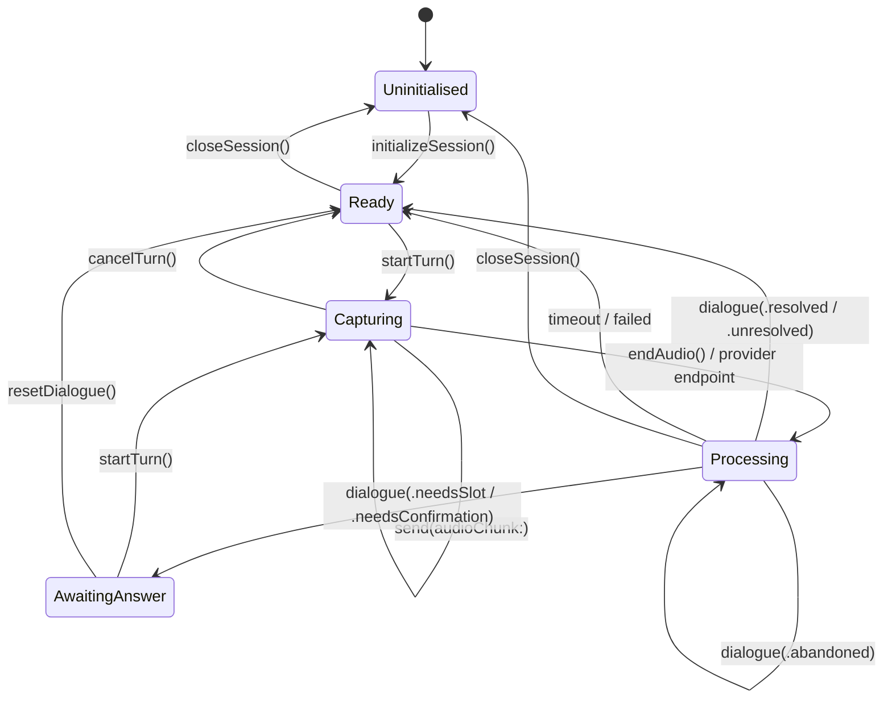

# SPEC — Voice Understanding Provider

**Status:** Draft · **Version:** 0.2 · **Date:** 21 August 2026
**Normative.** The key words **MUST**, **MUST NOT**, **SHOULD**, **SHOULD NOT**, and **MAY** are to be interpreted as in RFC 2119.
**Context:** [ADR-0001](./ADR-0001-voice-understanding-provider-abstraction.md) · [HLD](./HLD-voice-understanding.md)

---

## 1. Purpose

This document defines the contract between `PersonalVoiceAssistantServiceImpl` (the *host*) and any intent-understanding implementation (a *provider*). A conforming provider can be substituted for any other without changes to the host, the intent handlers, or the UI.

Two providers are in scope at v0.1: `DialogflowVoiceUnderstandingAdapter` and `OnDeviceVoiceUnderstandingAdapter`.

## 2. Type surface

All types **MUST** be `Sendable`. All types **MUST** be free of provider-specific vocabulary: no protobuf types, no `VoiceAIKit` types, no URLs pointing at a specific backend.

### 2.1 Protocol

```swift
public protocol VoiceUnderstandingProvider: AnyObject {

    /// Static description of what this provider can do. MUST NOT change after init.
    var capabilities: ProviderCapabilities { get }

    /// The PCM format this provider requires. The host converts to it.
    var audioFormat: ProviderAudioFormat { get }

    /// Hot event stream. MUST deliver on a single serial scheduler.
    var events: Observable<VoiceUnderstandingEvent> { get }

    // Session lifecycle
    func initializeSession() -> Completable
    func closeSession()

    // Turn lifecycle
    func startTurn()
    func send(audioChunk: Data)
    func endAudio()
    func cancelTurn()

    // Dialogue lifecycle
    func resetDialogue()

    // Capture control (host-driven TTS serialisation — see §6.2)
    func suspendCapture()
    func resumeCapture()
}
```

### 2.2 Events

```swift
public enum VoiceUnderstandingEvent: Sendable {
    /// Best-effort in-progress transcript. MAY be emitted zero or more times per turn.
    case partialTranscript(String)
    /// Committed transcript for the turn. MUST be emitted exactly once before any
    /// `.dialogue` event for that turn, unless the turn ends in `.timeout` or `.failed`.
    case finalTranscript(String)
    /// The conversational outcome of the turn.
    case dialogue(DialogueOutcome)
    /// No speech detected, or the provider gave up waiting. Terminal for the turn.
    case timeout
    /// Transport, model, or permission failure. Terminal for the turn.
    case failed(ProviderFailure)
}
```

### 2.3 Dialogue outcomes

```swift
public enum DialogueOutcome: Sendable {
    /// A required slot is missing. The host MUST speak `question` and start a new turn.
    case needsSlot(intent: String, question: String, collected: [String: ParameterValue])

    /// A yes/no gate. The host MUST speak `question` and start a new turn.
    case needsConfirmation(intent: String, question: String)

    /// Fully understood and ready to act on.
    case resolved(IntentResolution)

    /// Not understood, or deliberately out of scope. The host MUST run its own
    /// fallback chain. Providers MUST NOT attempt any fallback themselves.
    case unresolved(reason: UnresolvedReason, queryText: String, diagnostics: ClassificationDiagnostics?)

    /// The user changed topic mid-dialogue; `cancelledIntent` was abandoned.
    ///
    /// NOT turn-ending (§3.2.6). The outcome for the new utterance arrives as the NEXT
    /// `.dialogue` event, which is the one that ends the turn.
    case abandoned(cancelledIntent: String)
}

public enum UnresolvedReason: Sendable {
    case belowConfidenceThreshold
    case outOfScope
    case noIntentMatch
    case unsupportedLanguage
}
```

### 2.4 Resolution payload

```swift
public struct IntentResolution: Sendable {
    /// Verbatim user utterance for this turn.
    public let queryText: String
    /// Canonical intent label. MUST match the shared intent catalogue exactly.
    public let intentName: String
    /// Extracted slots, keyed by canonical slot name.
    public let parameters: [String: ParameterValue]
    /// Provider-authored response text, if any. MAY be empty.
    public let fulfillmentTexts: [String]
    /// Diagnostic only. MUST NOT be used for cross-provider comparison. See §5.
    public let confidence: Double?
    /// On-device stage breakdown. `nil` on providers that cannot produce it.
    public let diagnostics: ClassificationDiagnostics?
}

/// Closed parameter vocabulary. Replaces `[String: Any]` so the payload is
/// Sendable, exhaustively testable, and safe to encode for analytics.
public enum ParameterValue: Sendable, Equatable {
    case string(String)
    case number(Double)
    case boolean(Bool)
    case date(DateComponents)          // resolved calendar value, not a phrase
    case duration(TimeInterval)
    case list([ParameterValue])
    /// Escape hatch for provider values not yet modelled. Every occurrence MUST be
    /// logged at WARN and MUST be reviewed; this case is a migration aid, not a design.
    case unmodelled(String)
}
```

### 2.5 Capabilities and identity

```swift
public struct ProviderCapabilities: Sendable {
    /// Stable identity for telemetry and incident attribution. See §8.
    public let providerIdentity: ProviderIdentity
    /// BCP-47 language tags this provider can serve.
    public let supportedLanguages: [String]
    public let requiresNetwork: Bool
    public let emitsPartialTranscripts: Bool
    public let emitsConfidence: Bool
    public let supportsTopicInterruption: Bool
    /// Intent families whose dialogue the HOST owns. Providers MUST return these
    /// as terminal `.resolved` and MUST NOT open a slot or confirmation flow.
    public let appOwnedIntentFamilies: Set<String>
}

public struct ProviderIdentity: Sendable {
    public let kind: String            // "dialogflow" | "on-device"
    public let implementationVersion: String
    /// On-device only: model bundle version, e.g. "pack-en-v1.0.26".
    public let modelBundleVersion: String?
    /// On-device only: checksum of the bundle named above.
    public let modelChecksum: String?
}

public struct ProviderAudioFormat: Sendable {
    public let sampleRate: Int         // Hz
    public let channelCount: Int
    public let encoding: Encoding      // .linearPCM16
    public let preferredChunkDuration: TimeInterval
}
```

### 2.6 Diagnostics

```swift
public struct ClassificationDiagnostics: Sendable {
    /// 1 = keyword rule, 2 = statistical, 3 = semantic, nil = below all thresholds.
    public let winningStage: Int?
    public let stageScores: [Int: Double]
    public let latency: Duration
}
```

Diagnostics are for logging, debug UI, and offline analysis. Host business logic **MUST NOT** branch on them.

## 3. Lifecycle

### 3.1 State machine



### 3.2 Rules

1. `initializeSession()` **MUST** be idempotent and **MUST** complete before the first `startTurn()`.
2. `send(audioChunk:)` outside `Capturing` **MUST** be discarded silently. It **MUST NOT** throw or crash.
3. A provider **MAY** end a turn on its own endpointing without `endAudio()`. When it does, it **MUST** emit `.finalTranscript` before the corresponding `.dialogue` event.
4. `cancelTurn()` **MUST** discard in-flight audio and emit no further events for that turn. It **MUST NOT** clear dialogue state; use `resetDialogue()` for that.
5. `closeSession()` **MUST** release all resources — network channels, audio graphs, loaded models — and **MUST** be safe to call from any state.
6. Exactly one **turn-ending** event **MUST** be emitted per turn. The turn-ending events are
   `.dialogue(.needsSlot)`, `.dialogue(.needsConfirmation)`, `.dialogue(.resolved)`,
   `.dialogue(.unresolved)`, `.timeout`, and `.failed`.

   `.dialogue(.abandoned)` is **NOT** turn-ending. It reports that a dialogue in progress was
   discarded, and it **MUST** be followed by exactly one turn-ending event for the same
   utterance. A turn that abandons therefore emits two `.dialogue` events, in this order:

   ```
   .finalTranscript("actually what's the battery level")
   .dialogue(.abandoned(cancelledIntent: "Cmd.SetReminder"))   ← the flow that died
   .dialogue(.resolved(...))                                    ← the new utterance's outcome
   ```

   A provider **MUST NOT** suppress `.abandoned` to satisfy this rule. The host has UI and state
   bound to the dialogue that was in progress — a half-filled reminder card, a pending question —
   and silently swapping it for an unrelated outcome leaves that state stranded. This is also why
   `capabilities.supportsTopicInterruption` exists: a provider that suppresses the event
   **MUST** report `false`, because a host cannot act on an interruption it is never told about.

   `.abandoned` **MUST NOT** be emitted more than once per turn, and **MUST NOT** be the last
   event of a turn.
7. Every event for a given session **MUST** be delivered on one serial scheduler, in emission order.

## 4. Host obligations

The host is not passive; conformance is bidirectional.

1. The host **MUST** own microphone capture and **MUST** convert captured audio to `provider.audioFormat` before calling `send(audioChunk:)`.
2. The host **MUST** perform all text-to-speech. It **MUST NOT** rely on any provider to speak.
3. On `.needsSlot` / `.needsConfirmation`, the host **MUST** speak the question, then call `startTurn()` and resume capture. It **MUST NOT** call `initializeSession()` again — dialogue state lives in the provider.
4. On `.unresolved`, the host **MUST** run its own fallback chain (CMS → GenAI → Wolfram).
5. On `.resolved` where `intentName` is in `capabilities.appOwnedIntentFamilies`, the host **MUST** call `resetDialogue()` before dispatching, so the provider cannot capture a subsequent yes/no belonging to the host's own state machine.
6. The host **MUST NOT** compare `confidence` values across providers (§5).
7. The host **MUST** log `capabilities.providerIdentity` with every session (§8).

## 5. Confidence is not comparable

`confidence` on `IntentResolution` is a provider-local score. The on-device provider reports a temperature-calibrated probability from a specific model version; Dialogflow reports its own, produced by a different method against a different label space.

Therefore:

- The host **MUST NOT** threshold on `confidence`.
- The host **MUST NOT** compare `confidence` between providers, in code or in dashboards, without an explicit calibration study.
- Providers **MUST** perform their own thresholding internally and express the result as `.unresolved`, never by returning a low-confidence `.resolved` and expecting the host to filter it.

`emitsConfidence == false` is legitimate. Hosts **MUST** handle `confidence == nil`.

## 6. Provider-specific conformance notes

### 6.1 `DialogflowVoiceUnderstandingAdapter`

- **MUST** wrap the existing `PvaProxyServiceImpl` without modifying it.
- **MUST** map `allRequiredParamsPresent == false` to `.needsSlot`, using `fulfillmentMessage` as `question` and the already-populated `parameters` as `collected`. This replaces `RequiredParamsIntentHandler`.
- **MUST** map an empty or unmatched intent to `.unresolved(.noIntentMatch, queryText:)`.
- **MUST** map `PvaProxyServiceError` values to `.timeout` or `.failed`, preserving today's timeout durations exactly.
- **MUST NOT** allow any generated protobuf type to appear in its public API.
- **SHOULD** report `supportsTopicInterruption == false`.
- `parameters` mapping from Dialogflow's `Struct` **MUST** be total: every inhabitant maps to a `ParameterValue` case, with `.unmodelled` as the logged fallback (see open question Q2).

### 6.2 `OnDeviceVoiceUnderstandingAdapter`

- **MUST** construct `VoiceIntentSession` with `speaksPrompts: false` and `audioSource: .injected(...)`.
- **MUST** map `NLUResponse` cases as follows:

| `NLUResponse` | `DialogueOutcome` |
|---|---|
| `.prompt(intent, question, filled)` | `.needsSlot(intent:question:collected:)` |
| `.confirm(intent, _, question)` | `.needsConfirmation(intent:question:)` |
| `.fulfill(intent, _, params, message, confidence, rescue, breakdown)` | `.resolved(IntentResolution(...))` with `fulfillmentTexts: [message]` |
| `.fallback(intent, confidence, breakdown)` | `.unresolved(reason:queryText:diagnostics:)` — `intent` is the pack's own out-of-scope label (`Default Fallback Intent`) and **MUST NOT** be surfaced as a resolved intent |
| `.interrupted(cancelled, inner)` | `.abandoned(cancelledIntent:)`, then map `inner` as the next event |

- **MUST NOT** import or link any URL-opening or networking API.

  *Historical note (VIK-031, fixed 21 Aug 2026):* this rule previously read "the kit's `fallbackURL`
  is a hand-off mechanism for a different host". That URL no longer exists. `NLUResponse.fallback`
  carried a URL built from unsigned pack data with the user's verbatim transcript in its query
  string — the only path in the kit that reached the network at all. It was removed and replaced
  with the pack's out-of-scope intent name. There is nothing left to discard; the rule stands as a
  boundary, not as a workaround.
- **MUST** call `VoiceIntentSession.reset()` when the host calls `resetDialogue()`.
- **MUST** implement `suspendCapture()` / `resumeCapture()` such that no audio captured during host TTS reaches the recogniser.
- **MUST** populate `modelBundleVersion` and `modelChecksum` in `ProviderIdentity`.
- **SHOULD** report `supportsTopicInterruption == true`.

### 6.3 Yes/no arbitration

Both the provider's confirmation flow and the host's Push-to-Talk state machine consume "yes" and "no". Arbitration rule, in priority order:

1. If a host-owned dialogue (P2T) is active, the host consumes the utterance and the provider's dialogue state has already been reset per §4.5. The provider **MUST** therefore return yes/no as a plain `.resolved` intent.
2. Otherwise, if the provider is in `AwaitingAnswer`, the provider consumes it as a confirmation answer.
3. Otherwise it is a fresh utterance.

A provider **MUST NOT** be in `AwaitingAnswer` while a host-owned dialogue is active. Violation of that invariant is a defect in the host's §4.5 obligation, not in the provider.

## 7. Error taxonomy

```swift
public enum ProviderFailure: Sendable, Error {
    case notInitialised
    case permissionDenied(Permission)      // microphone, speech recognition
    case networkUnavailable                // cloud providers only
    case transport(underlying: String)     // gRPC / stream errors
    case modelUnavailable(reason: String)  // on-device: bundle missing, OS below floor
    case languageUnsupported(String)
    case internalError(underlying: String)
}
```

- `.networkUnavailable` **MUST NOT** be emitted by a provider whose `capabilities.requiresNetwork == false`.
- `.modelUnavailable` **SHOULD** be detectable at composition time and handled by the capability gate (HLD §6.1) rather than surfacing at runtime.
- Failures **MUST NOT** leave the provider in `Capturing`. Providers **MUST** return to `Ready` or `Uninitialised`.

## 8. Observability contract

Every session **MUST** be attributable. The host **MUST** record, once per session:

| Field | Source |
|---|---|
| `provider.kind` | `capabilities.providerIdentity.kind` |
| `provider.implementationVersion` | same |
| `provider.modelBundleVersion` | same, on-device only |
| `provider.modelChecksum` | same, on-device only |
| `provider.downgradeReason` | set by the capability gate when config asked for on-device and got cloud |

Per turn, the host **SHOULD** record intent name, terminal outcome kind, and end-to-end latency. It **MUST NOT** record raw transcripts or slot values without an explicit privacy review (open question Q4).

## 9. Versioning

This specification is versioned independently of the app. Breaking changes to the type surface increment the major version and require both adapters to be updated in the same change. Additive changes — new `ParameterValue` cases, new capability flags with defaults — increment the minor version and **MUST** be source-compatible with existing adapters.

## 10. Conformance checklist

An implementation is conforming when all of the following hold. Each maps to a test in [Test Strategy](./PLAN-test-strategy.md) §3.

- [ ] Exactly one turn-ending event per turn, in all paths including error and timeout
- [ ] `.abandoned` is followed by exactly one turn-ending event for the same utterance, and is
      never suppressed while `supportsTopicInterruption == true`
- [ ] `.finalTranscript` precedes `.dialogue` in every non-error turn
- [ ] Events delivered in order on a single serial scheduler
- [ ] `send(audioChunk:)` outside `Capturing` is silently discarded
- [ ] `initializeSession()` is idempotent
- [ ] `closeSession()` is safe from every state and releases all resources
- [ ] No provider-native type appears in the public API surface
- [ ] Intents in `appOwnedIntentFamilies` are always terminal `.resolved`
- [ ] Parameter mapping is total; `.unmodelled` occurrences are logged
- [ ] `providerIdentity` is fully populated
- [ ] Thresholding happens inside the provider, never by returning low-confidence `.resolved`
- [ ] (On-device) no URL-opening or networking API is linked by the adapter
